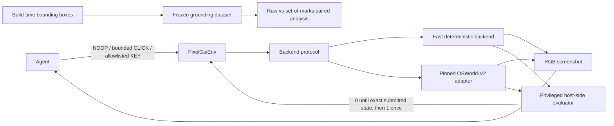

# PixelGym-OSWorld

PixelGym-OSWorld is a pixel-only Gymnasium environment and GUI-grounding benchmark for one
deterministic synthetic vendor-onboarding form, with an optional pinned OSWorld-V2 backend.
It tests whether bounded screenshot-only interaction, privileged exact-state reward, and seeded
reset behavior can be implemented and audited without leaking task answers to the agent.
Committed evidence measures that single workload, a 100-example grounding experiment, and a
local scripted evaluation-platform rehearsal—not broad desktop generalization or production scale.
The strongest visual claim is bitwise repeatability at 1024×768 on one local host; portability,
the frozen v1 allocation, model aliases, synthetic platform metrics, and human gates remain limited.

## Architecture



The observation is only an RGB screenshot. The evaluator reads privileged task state outside the
agent interface; expected values and bounding boxes never enter the environment observation or
`info`. Build-time grounding instrumentation is separate from the evaluation adapter.

## Evidence-backed claims

- Built and audited one seeded synthetic vendor-form environment with no learned model: for seed 7,
  five OSWorld resets were semantically and bitwise identical at 1024×768 on one local Apple
  Silicon Docker/QEMU host, and all 14 reward-hacking surfaces had evidence and a classified
  disposition. This does not establish cross-host bitwise portability; the historical 1920×1080
  OSWorld run established semantic task-state determinism and only perceptual visual stability
  ([reset evidence](artifacts/day-2-rev-2026-09-06-issues-95-101/raw/real-reset.json),
  [audit evidence](artifacts/day-2-rev-2026-09-06-issues-95-101/raw/reward-hacking.json),
  [revision environment](artifacts/day-2-rev-2026-09-06-issues-95-101/validation-report.json),
  [historical evidence](artifacts/day-2/raw/real-reset.json)).
- Evaluated 100 paired targets from the same synthetic form at 1024×768 with the Codex CLI provider
  and the moving `gpt-5.4-mini` alias: raw coordinates scored 56/100 and deterministic
  set-of-marks overlays scored 100/100, a +44.0-point paired difference with a fixed-seed bootstrap
  95% CI of [+35.0, +54.0]. This is one model alias, prompt, layout, and target-agnostic proposal
  generator—not evidence about other models or GUI workloads
  ([structured results](artifacts/grounding-results.json),
  [dataset](artifacts/grounding-dataset.jsonl)).
- Exercised the local-first evaluation fan-out on that 1024×768 frozen vendor-form dataset across
  4 seeds × 4 deterministic scripted-policy aliases: 16 branches and 80 scripted calls, with a
  maximum of 4 branches observed concurrently and 4 invalid assignments retained. The provider was
  the no-cost `scripted-demo` fixture on one local host; these are orchestration fixtures, not model
  quality or production-throughput measurements
  ([fan-out evidence](artifacts/platform/seed-policy-fanout-evidence-v1.json),
  [versioned plan](artifacts/platform/seed-policy-plan-v1.json),
  [frozen dataset](artifacts/grounding-dataset.jsonl)).


The project owner declared the [historical Day 2 gate](artifacts/day-2/raw/human-gate.json) `PASS`.
The [2026-09-06 evidence revision](artifacts/day-2-rev-2026-09-06-issues-95-101/validation-report.json)
is new raw evidence, not a replacement human verdict: its D2.11 re-grade remains pending. D4.12
also remains a human-owned milestone gate and is not declared here.

## Grounding benchmark

The frozen benchmark contains 100 examples: 20 task seeds across five screen states and ten control
targets. Raw-coordinate and set-of-marks conditions use the same target instruction. Candidate
generation is target-agnostic, overlays are deterministic, and proposal coverage is reported
separately from conditional mark-selection accuracy
([frozen dataset](artifacts/grounding-dataset.jsonl)).

The frozen v1 allocation perfectly aliases target identity with screen state: every target appears
in only one state. Control-type breakdowns for the stored v1 result are therefore descriptive
compositions, not independently identified control-type effects. Benchmark v2 fixes that design
for future evaluation with a separate 100-example crossed allocation: every target appears in every
screen state with two seed replicates per target-by-state cell. V2 reuses the target-neutral v1
captures and overlays, has not been run against a model, and does not change the reported v1 result
([v2 protocol](artifacts/grounding-v2-protocol.md),
[v2 manifest](artifacts/grounding-v2-manifest.json)).

Using Codex CLI with `gpt-5.4-mini` on 2026-08-10, raw-coordinate accuracy was **56/100
(56.0%)** and set-of-marks accuracy was **100/100 (100.0%)**. The paired difference was **+44.0
percentage points**, with a fixed-seed paired-bootstrap 95% CI of **[+35.0, +54.0]** and a
two-sided exact McNemar p-value of **1.137×10⁻¹³**. Proposal coverage was **100/100**; conditional
mark-selection accuracy was also **100/100**
([grounding results](artifacts/grounding-results.json)).


This is a measured result for one model alias, synthetic task family, prompt, layout, and screen
size. It supports the paired effect of adding these frozen overlays in this setup; it does not
establish why predictions changed or generalize to other GUI tasks. The manually reviewed 44 raw
errors included 31 wrong-semantic-element labels, 6 just-outside labels, and 7 coordinate-scaling
labels treated explicitly as reviewer inference. Labels are non-exclusive
([review decisions](artifacts/grounding-error-review-decisions.json)).

After the [default development setup](#quick-reproduction-without-osworld), offline reproduction
makes no model or network calls:

```bash
.venv/bin/python scripts/generate_grounding_report.py
```

The recorded run used the Codex CLI provider and current Codex login. An implemented but unused
OpenRouter alternative reads configuration only from the process environment:

```bash
export OPENROUTER_API_KEY="..."
export OPENROUTER_MODEL="provider/model-id"

.venv/bin/python scripts/run_grounding_evaluation.py \
  --provider openrouter --full --max-new-calls 0 --plan-only
```

`OPENROUTER_MODEL` must select an image-capable route with structured-output support. The adapter
uses strict JSON Schema, requires routed parameter support, and enables neither response healing nor
hidden retries. See OpenRouter's official
[image-input](https://openrouter.ai/docs/guides/overview/multimodal/image-understanding) and
[structured-output](https://openrouter.ai/docs/guides/features/structured-outputs) documentation.

## Platform milestone

The local-first platform wraps the frozen grounding workload with resumable evaluation, immutable
evidence storage, mechanical promotion gates, explicit human approval, exact-version serving, and
audited rollback. Its architecture keeps the control plane separate from MLflow metadata and the
authoritative immutable artifact store. See the [platform architecture](artifacts/platform/architecture.md)
and the [platform milestone plan](plans/grounding-evaluation-platform.md) for boundaries and
current scope.

### Local no-cost platform reproduction

The scripted lifecycle demo uses local services and a deterministic provider; its metrics are
synthetic governance fixtures, not model-quality evidence. It requires Docker and does not make
network model/provider calls. After the
[default development setup](#quick-reproduction-without-osworld), run from the repository root:

```bash
python3.12 scripts/platform_compose.py up --build --wait
```

Open the control plane at <http://localhost:5800> and MLflow at <http://localhost:5500>. Stop the
stack while retaining its local evidence with:

```bash
python3.12 scripts/platform_compose.py down
```

Both UI ports are bound to host loopback for this local demo. The control plane has CSRF
protection but no caller authentication; it must not be exposed or proxied onto a shared network.
Add authentication and authorization in front of both the control plane and MLflow before any
shared deployment.

Use this wrapper rather than invoking `docker compose` against `deploy/compose.yaml` directly: it
derives and bind-mounts the source-provenance file required to verify the packaged source. If a
previous direct invocation created a directory at `.cache/platform/source-provenance.json`, follow
the safe recovery steps in the [deployment guide](deploy/README.md#recover-a-directory-created-by-a-direct-compose-invocation).
The deployment guide also documents the separate fast, local-runtime, and isolated
Compose/Playwright test commands, their prerequisites, cleanup scope, and expected cold-run time.

The recorded lifecycle, generated API transcript, immutable-artifact verification, and known
limitations are available in the [demo script](artifacts/platform/demo-script.md),
[API transcript](artifacts/platform/demo-api-transcript.jsonl),
[integrity evidence](artifacts/platform/immutable-artifact-verification.json), and
[platform limitations](artifacts/platform/known-limitations.md). D4.12 remains a human-owned
milestone gate; this documentation does not declare it passed.

## v5 agent benchmark (in progress)

V5 is a separate protocol that evaluates a complete versioned policy system — model, prompt,
memory, harness, parser, and coordinate adapter — end to end on stateful workflows, after the v4c
pilot saturated at the episode level. It preserves the pixel-only observation, bounded action,
privileged evaluator, and sparse reward contracts described below
([v5 plan](plans/grounding-v5-agent-benchmark.md)).

**Completed calibration results are now published, but no v5 result is a benchmark score or a
milestone-gate verdict.** Every retained D5.6 full-calibration run that completed its 50 assigned
tasks and passed the committed-evidence checks appears below. Attempted tasks and every terminal
classification remain separate:

| Policy slot | Provider / model alias | Assigned | Attempted | Exact success | Invalid output | Request failure | Infrastructure failure | Policy violation | Truncation | Unknown-charge reservation |
|---|---|---:|---:|---:|---:|---:|---:|---:|---:|---:|
| `A-gemini-stateful-v3` | `openrouter/google-vertex/global` / `google/gemini-3.7-flash` | 50 | 50 | 35 (70.0%) | 1 | 1 | 0 | 0 | 13 | $1.990656000 (20 outcomes) |
| `B-qwen-stateful-v3` | `openrouter/alibaba` / `qwen/qwen3-vl-8b-instruct` | 50 | 50 | 0 (0.0%) | 3 | 0 | 0 | 0 | 47 | $0.000000000 (0 outcomes) |

These are descriptive calibration results, not confirmatory results or controlled model
comparisons. Both runs reached their assigned denominator without tripping a hard-stop guard.
Both runs bind the same prompt, memory, parser, response-schema, coordinate-adapter, retry-policy,
and calibration-partition manifest (`sha256:41034ec1…`). Their approved stop conditions, spend
reconciliation, and evidence bindings are recorded in the
[generated report](artifacts/grounding-v5-d56-completed-calibrations-report.md) and
[response-content-free derivative](artifacts/grounding-v5-d56-completed-calibrations-publishable.json).
They are not controlled comparisons: policy-manifest digests, code revisions, and runtime digests
differ; Qwen v3 records temperature 0 while Gemini v3b records no temperature; and Gemini v3b
records strict upstream `json_schema` response validation while Qwen v3 has no
`response_validation` block.
The approved endpoint records were observed on 2026-08-28 and the retained evidence was committed
with author dates on 2026-09-02 (committed-history dates, not execution timestamps); the run
execution dates were not recorded in the committed plans or summaries.

Two other retained runs were inventoried and audited but not promoted into this completed table.
Gemini v3 stopped after 5 of 50 assignments when its run ledger blocked and failed
`completed_assigned_denominator` and `publication_relation_verified`. The older
`B-qwen-stateful-v2` run stopped after 13 of 50 assignments at the first invalid output, as its
approved plan required, and failed `completed_assigned_denominator`; its historical
[partial report](artifacts/grounding-v5-d56-qwen-full-calibration-report.md) remains available.

The earlier `A-gemini-stateful-v2` calibration remains **withdrawn**. Its evidence and reports were
removed rather than corrected in place because its stored plan and summaries contained absolute
operator paths whose removal would invalidate their recorded SHA-256 values. It is not repaired or
included in the published result. The producer-side path defect is fixed in
`pixelgym/grounding/v5/evidence.py`.

PR #155 changed the taxonomy for CLI process failures. All four retained runs used HTTP/OpenRouter
transports, and no episode or transport row carries a `cli_fault` key, so the number of
`invalid_output` rows that could be former-taxonomy CLI process failures is bounded at zero;
historical labels are not rewritten. Qwen v3's separate frozen predecessor records one attempted
pair terminated by an HTTP 429 `unknown_outcome_infrastructure_failure`; that predecessor is not
part of Qwen v3's 50-assignment row, whose infrastructure-failure count remains zero. Restricted
attempt journals still hold raw provider responses, screenshots, and private checkpoints. They are
declared `must_not_commit` in the
[publication relation](artifacts/grounding-v5-d56-completed-calibrations-publication-relation.json),
and the [integrity audit](artifacts/grounding-v5-d56-completed-calibrations-integrity-audit.json)
discloses that their file hashes and row-level contents are unavailable from a public clone.

## Quick reproduction without OSWorld

Python 3.12 is required. The default development setup does not install OSWorld and the fast suite
does not need a VM, browser, network, or provider credentials.

```bash
python3.12 -m venv .venv
.venv/bin/pip install -e ".[dev]"

.venv/bin/ruff check .
.venv/bin/mypy pixelgym
.venv/bin/pytest -q -n auto tests/unit
.venv/bin/python scripts/golden_trajectory.py check
.venv/bin/python scripts/demo_fake_backend.py --seed 7
```

The documented fast-suite target uses the `pytest-xdist` dependency included in the `dev` extra to
run independent tests in parallel. Serial execution remains supported but is not the under-one-minute
timing target. The editable install is sufficient for the fast suite, lint, and strict static type
check of the complete `pixelgym` package. Re-capturing the
frozen browser dataset additionally requires Playwright's Chromium binary, installed once with:

```bash
.venv/bin/python -m playwright install chromium
.venv/bin/python scripts/validate_vendor_form_browser_boundary.py \
  --output artifacts/local/browser-boundary.json
.venv/bin/python scripts/capture_grounding_dataset.py
```

To revalidate the checked-in dataset, candidate records, image hashes, allocation summary, and
known design limitations without launching a browser or rewriting capture assets, run:

```bash
.venv/bin/python scripts/capture_grounding_dataset.py --summary-only
```

To deterministically rebuild the balanced v2 metadata and audit sheets from the checked-in,
target-neutral v1 capture assets without any model calls, run:

```bash
.venv/bin/python scripts/build_grounding_benchmark_v2.py
```

The scripted incomplete-submit demo stays at reward `0.0`. The separate golden trajectory checks
that all preceding rewards are zero, the exact valid submission pays `1.0` once, and the episode
terminates rather than truncates.

## Real OSWorld-V2 integration

The integration is pinned to OSWorld-V2 tag `v2026.06.24` at commit
`2b9b7b4eb73243d557bdbf2998fe18d8e18e19c6`. The historical Day 2 run used Python 3.12.13 and
1920×1080 screenshots. The 2026-09-06 revision used Python 3.12.14 and 1024×768 observations; both
used a digest-pinned native ARM64 QEMU host around the release's unchanged x86-64 guest. Full
provider and image metadata are recorded in the historical
[validation artifact](artifacts/validation-report.json) and the
[current revision](artifacts/day-2-rev-2026-09-06-issues-95-101/validation-report.json).
Start with the [default development setup](#quick-reproduction-without-osworld), then install the
optional integration dependency and run:

```bash
.venv/bin/pip install -e ".[osworld]"
.venv/bin/python scripts/prepare_osworld_docker.py
.venv/bin/python scripts/validate_vendor_form_browser_boundary.py \
  --output artifacts/local/browser-boundary.json
.venv/bin/python scripts/smoke_osworld_reset.py
.venv/bin/python scripts/osworld_space_smoke.py
.venv/bin/python scripts/osworld_golden_trajectory.py check
.venv/bin/python scripts/validate_day2.py real-resets
.venv/bin/python scripts/validate_day2.py audit
.venv/bin/python scripts/validate_day2.py assemble
.venv/bin/python scripts/generate_validation_report.py
```

Preparation downloads the release's 14.2 GB compressed guest artifact. Apple Silicon still runs
the x86-64 guest without KVM; the recorded first expanded reset took 183.23 seconds
([validation evidence](artifacts/validation-report.json)).

## Environment contract

- Observation: an RGB `uint8` screenshot only.
- Actions: `NOOP`, bounded integer `CLICK(x, y)`, or `KEY(index)` into a versioned allowlist.
- Invalid actions: rejected before backend execution; coordinates are never clipped.
- Reward: `0.0` until one exact host-evaluated submission, then `1.0` exactly once.
- Episode end: success sets `terminated=True`; step limit sets `truncated=True`.
- Post-episode step: raises a clear error.
- Reset: same seed produces the same canonical task, task hash, and initial application state and
  clears prior submissions.

These behaviors are exercised by the stored
[validation report](artifacts/validation-report.json) and fast test suite.

## Reward-hacking audit

The stored audit covers 14 surfaces, including self-declared completion, incomplete submission,
visible fake success text, stale task identity, repeated submission, coordinate violations,
post-episode calls, modifier/devtools access, direct navigation, action mutation after validation,
and termination/truncation confusion. Each is classified as `blocked`, `tested`, `mitigated`, or a
known limitation, with the underlying evidence retained
([reward-hacking evidence](artifacts/day-2-rev-2026-09-06-issues-95-101/raw/reward-hacking.json)).

## Limitations

- This is one deterministic synthetic form, not a broad desktop-task distribution.
- The current app-mode reset evidence records five mutually bitwise-identical 1024×768 frames,
  without a mask or tolerance. That single local-Docker run does not establish bitwise portability
  across hosts. The retained `04b` navigation-boundary frame was captured before page
  initialization completed because the prior launch/readiness path did not prevent an intermediate
  paint from becoming the observation. The launch now requires two consecutive page-ready
  acknowledgements; the evidence probe independently verifies `ready: true` after reset and then
  captures a fresh stable frame. The replacement `04c` frame is bitwise-identical to all five reset
  frames: 0 differing pixels and maximum per-channel delta 0 before the separately reported SSIM.
  The immutable historical evidence also retains its earlier live-clock differences
  ([current comparison](artifacts/day-2-rev-2026-09-06-issues-95-101/raw/renderer-screenshot-differences.json)).
- The historical 1920×1080 OSWorld run established semantic task-state determinism and measured
  unmasked perceptual visual stability (minimum SSIM 0.999863), not bitwise visual determinism. The
  2026-09-06 1024×768 revision measured bitwise visual determinism only on one local host; its
  D2.11 human re-grade remains pending.
- The Apple Silicon path uses software emulation for the released x86-64 guest and is slow.
- OSWorld is an optional dependency that downloads a 14.2 GB compressed guest artifact and requires
  Docker; the default fast suite uses neither OSWorld nor a VM.
- Digest pinning mitigates mutable runtime tags; it does not eliminate third-party publisher risk.
- The privileged state endpoint exists inside the guest. The guest Chromium app-mode contract removes
  address-bar, tab, and desktop navigation affordances from the tested bounded-click observation;
  containment against a browser or guest OS exploit remains outside the threat model.
- The grounding model identifier may be a moving alias rather than an immutable snapshot.
- Target identity is perfectly aliased with screen state in the frozen v1 grounding dataset, so
  v1 control-type slices cannot separate control-type and screen-state effects. The unrun v2
  allocation crosses every target with every state, with only two seed replicates per cell.
- The grounding experiment covers one model, prompt, resolution, synthetic application layout, and
  target-agnostic candidate generator; its result should not be generalized beyond that scope.
- Platform demo and seed-by-policy fan-out metrics use deterministic scripted providers on one
  local host. They are synthetic governance and orchestration fixtures, not model-quality,
  production-throughput, or external-deployment evidence.
- D4.12 has stored raw evidence but no human milestone verdict. V5 calibration results are
  descriptive and remain neither benchmark scores nor a milestone-gate verdict.

## Project evidence

- [`artifacts/validation-report.md`](artifacts/validation-report.md) — generated Day 2 report
- [`artifacts/day-2/real-golden/contact-sheet.png`](artifacts/day-2/real-golden/contact-sheet.png) — real episode frames
- [`artifacts/grounding-protocol.md`](artifacts/grounding-protocol.md) — frozen experiment protocol
- [`artifacts/grounding-dataset.jsonl`](artifacts/grounding-dataset.jsonl) — frozen 100-example dataset
- [`artifacts/grounding-report.md`](artifacts/grounding-report.md) — reproducible paired analysis
- [`artifacts/grounding-v2-protocol.md`](artifacts/grounding-v2-protocol.md) — crossed v2 design
- [`artifacts/grounding-v2-manifest.json`](artifacts/grounding-v2-manifest.json) — validated v2 allocation and input/output hashes
- [`artifacts/platform/seed-policy-fanout-evidence-v1.json`](artifacts/platform/seed-policy-fanout-evidence-v1.json) — local scripted fan-out evidence
- [`artifacts/public-release-inventory.json`](artifacts/public-release-inventory.json) — public-path, redaction, restricted-asset, and raw-payload inventory
- Incomplete v5 calibration reports, response-content-free derivatives, and stored-evidence
  integrity audits are linked from
  [v5 agent benchmark (in progress)](#v5-agent-benchmark-in-progress) above, with their coverage
  limits stated there.

## Sprint plans

- [`plans/sprint-1-environment-core.md`](plans/sprint-1-environment-core.md)
- [`plans/sprint-2-osworld-integration-and-validation.md`](plans/sprint-2-osworld-integration-and-validation.md)
- [`plans/sprint-3-grounding-and-portfolio.md`](plans/sprint-3-grounding-and-portfolio.md)
- [`plans/grounding-evaluation-platform.md`](plans/grounding-evaluation-platform.md)
- [`plans/grounding-v5-agent-benchmark.md`](plans/grounding-v5-agent-benchmark.md)
- [`plans/public-release-checklist.md`](plans/public-release-checklist.md) — unticked human release gate

## License

Copyright 2026 Michael Swailes. Licensed under the Apache License, Version 2.0. See
[`LICENSE`](LICENSE) and [`NOTICE`](NOTICE). Bundled DejaVu fonts retain their separate notices and
license terms listed in `NOTICE`.
