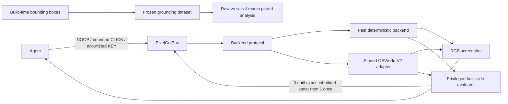
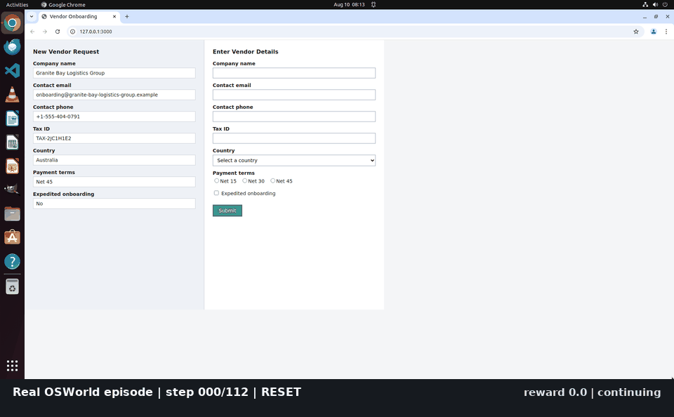
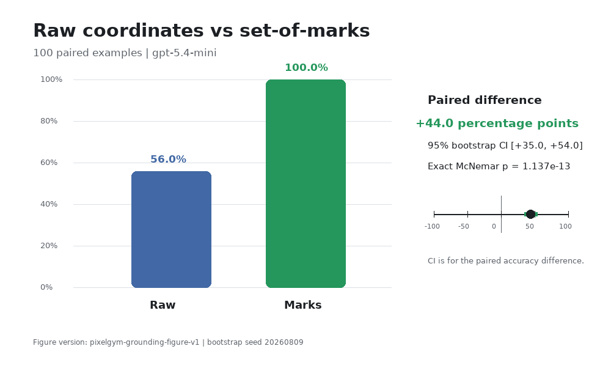

# PixelGym-OSWorld

PixelGym-OSWorld is a pixel-only Gymnasium environment and GUI-grounding benchmark for one
deterministic synthetic vendor-onboarding form, with an optional pinned OSWorld-V2 backend.
It tests whether bounded screenshot-only interaction, privileged exact-state reward, and seeded
reset behavior can be implemented and audited without leaking task answers to the agent.
Committed evidence measures that single workload, a 100-example grounding experiment, and a
local scripted evaluation-platform rehearsal—not broad desktop generalization or production scale.
The strongest visual claim is bitwise repeatability at 1024×768 on one local host; portability,
the frozen v1 allocation, model aliases, synthetic platform metrics, and human gates remain limited.

The narrow workload makes exact expected state, reproducible resets, and adversarial reward checks
tractable. That lets the project test environment contracts and evaluator boundaries directly,
then rehearse evidence retention, promotion, and rollback against a fixed workload.

Start with the three claims below, [reproduce the checks](#quick-reproduction-without-osworld), or
open the [evidence index](docs/evidence-index.md) for the full audit trail.

## Architecture



The observation is only an RGB screenshot. The evaluator reads privileged task state outside the
agent interface; expected values and bounding boxes never enter the environment observation or
`info`. Build-time grounding instrumentation is separate from the evaluation adapter.

## Evidence-backed claims

- Built and audited one seeded synthetic vendor-form environment with no learned model: for seed 7,
  five OSWorld resets were semantically and bitwise identical at 1024×768 on one local Apple
  Silicon Docker/QEMU host, and all 14 reward-hacking surfaces had evidence and a classified
  disposition. This does not establish cross-host bitwise portability; the historical 1920×1080
  OSWorld run established semantic task-state determinism and only perceptual visual stability
  ([reset evidence](artifacts/day-2-rev-2026-09-06-issues-95-101/raw/real-reset.json),
  [audit evidence](artifacts/day-2-rev-2026-09-06-issues-95-101/raw/reward-hacking.json),
  [revision environment](artifacts/day-2-rev-2026-09-06-issues-95-101/validation-report.json),
  [historical evidence](artifacts/day-2/raw/real-reset.json)).
- Evaluated 100 paired targets from the same synthetic form at 1024×768 with the Codex CLI provider
  and the moving `gpt-5.4-mini` alias: raw coordinates scored 56/100 and deterministic
  set-of-marks overlays scored 100/100, a +44.0-point paired difference with a fixed-seed bootstrap
  95% CI of [+35.0, +54.0]. This is one model alias, prompt, layout, and target-agnostic proposal
  generator—not evidence about other models or GUI workloads
  ([structured results](artifacts/grounding-results.json),
  [dataset](artifacts/grounding-dataset.jsonl)).
- Exercised the local-first evaluation fan-out on that 1024×768 frozen vendor-form dataset across
  4 seeds × 4 deterministic scripted-policy aliases: 16 branches and 80 scripted calls, with a
  maximum of 4 branches observed concurrently; it retained 4 invalid assignments and 4
  request-failure assignments containing 20 failed requests. The provider was the no-cost
  `scripted-demo` fixture on one local host; these are orchestration fixtures, not model quality or
  production-throughput measurements
  ([fan-out evidence](artifacts/platform/seed-policy-fanout-evidence-v1.json),
  [versioned plan](artifacts/platform/seed-policy-plan-v1.json),
  [frozen dataset](artifacts/grounding-dataset.jsonl)).



**Status.** This is a personal portfolio project prepared for review. Sprints 1–3 are complete and
gated by the owner ([D1.8](artifacts/day-1/human-gate.json), [D2.11](artifacts/day-2/raw/human-gate.json),
[D3.11](artifacts/day-3/raw/human-gate.json), [D4.12](artifacts/platform/human-gate.json)); the v5 agent
benchmark and v5 serving work remain in progress and no v5 gate is declared. The recorded
D4.12 decision applies to its reviewed revision and scripted-provider scope, not to later v5 work. Every number below links to a
checked-in artifact. Pull requests run lint, strict type checking, and the fast suite in CI; the
Docker-based platform integration suite runs only on manual dispatch.

The project owner declared the [historical Day 2 gate](artifacts/day-2/raw/human-gate.json) `PASS`.
The [2026-09-06 evidence revision](artifacts/day-2-rev-2026-09-06-issues-95-101/validation-report.json)
was re-graded by the project owner on 2026-09-07 and declared `PASS`
([re-grade record](artifacts/day-2-rev-2026-09-06-issues-95-101/raw/human-gate.json)); the historical
record is retained unchanged. The project owner declared the platform milestone gate D4.12 `PASS`
on 2026-09-09 against the evidence at revision `4c4a7fb`
([gate record](artifacts/platform/human-gate.json), [evidence index](artifacts/platform/d4.12/4c4a7fb2fcb983e81084542365abc0ec2d7df538/REPORT.md)).

## Grounding benchmark

The frozen raw-coordinate and set-of-marks experiment uses the same target instruction in each
condition, deterministic target-agnostic proposals, and separate coverage and conditional-selection
metrics ([structured results](artifacts/grounding-results.json)).



**Frozen v1 confounds target identity with screen state:** each target occurs in only one state,
so control-type slices cannot identify independent control-type effects. The crossed v2 allocation
is available but has not been run against a model. See the [paired analysis](artifacts/grounding-report.md),
[v2 protocol](artifacts/grounding-v2-protocol.md), and [v2 manifest](artifacts/grounding-v2-manifest.json).
The moving model alias and this single layout limit interpretation of the measured improvement.

## Platform milestone

The local-first platform wraps the frozen grounding workload with resumable evaluation, immutable
evidence storage, mechanical promotion gates, explicit human approval, exact-version serving, and
audited rollback. Its architecture keeps the control plane separate from MLflow metadata and the
authoritative immutable artifact store. See the [platform architecture](artifacts/platform/architecture.md)
and the [platform milestone plan](plans/grounding-evaluation-platform.md) for boundaries and
current scope.

### Local no-cost platform reproduction

The scripted lifecycle demo uses local services and a deterministic provider; its metrics are
synthetic governance fixtures, not model-quality evidence. It requires Docker and Python 3.12 but
does not require the project virtual environment or make network model/provider calls. Run from the
repository root:

```bash
python3.12 scripts/platform_compose.py up --build --wait
```

Open the control plane at <http://localhost:5800> and MLflow at <http://localhost:5500>. Stop the
stack while retaining its local evidence with:

```bash
python3.12 scripts/platform_compose.py down
```

Both UI ports are bound to host loopback for this local demo. The control plane has CSRF
protection but no caller authentication; it must not be exposed or proxied onto a shared network.
Add authentication and authorization in front of both the control plane and MLflow before any
shared deployment.

Use this wrapper rather than invoking `docker compose` against `deploy/compose.yaml` directly: it
derives and bind-mounts the source-provenance file required to verify the packaged source. If a
previous direct invocation created a directory at `.cache/platform/source-provenance.json`, follow
the safe recovery steps in the [deployment guide](deploy/README.md#recover-a-directory-created-by-a-direct-compose-invocation).
The deployment guide also documents the separate fast, local-runtime, and isolated
Compose/Playwright test commands, their prerequisites, cleanup scope, and expected cold-run time.
The same integration suite is wired as a manually dispatched GitHub Actions workflow
(`.github/workflows/platform-integration.yml`); it is not scheduled.

The [lifecycle demo](artifacts/platform/demo-script.md),
[API transcript](artifacts/platform/demo-api-transcript.jsonl), and
[platform limitations](artifacts/platform/known-limitations.md) document the rehearsal. Reliability
and other residual work remain tracked in [#166](https://github.com/elanthus/OSWorldTasks/issues/166),
[#165](https://github.com/elanthus/OSWorldTasks/issues/165), and
[#167](https://github.com/elanthus/OSWorldTasks/issues/167).

## v5 agent benchmark (in progress)

V5 evaluates a versioned model, prompt, memory, harness, parser, and coordinate adapter together
on stateful workflows. **The confirmatory benchmark and v5 serving work remain unfinished; no v5
gate is declared.** See the [benchmark plan](plans/grounding-v5-agent-benchmark.md) and
[serving plan](plans/v5-policy-serving.md).

Retained descriptive calibration includes Gemini v3 with 35/50 exact successes and Qwen v3 with
0/50. These are different policy systems and runtime configurations, not a controlled model
comparison ([structured derivative](artifacts/grounding-v5-d56-completed-calibrations-publishable.json)).
The [generated calibration report](artifacts/grounding-v5-d56-completed-calibrations-report.md)
retains assigned and attempted denominators, every terminal classification, incomplete runs,
spend reservations, and historical taxonomy.

The earlier Gemini v2 calibration is **withdrawn**, not repaired or included: removing absolute
operator paths from its digest-bound evidence would invalidate the recorded hashes. Restricted
journals remain unpublished; a public clone cannot verify their file hashes or row-level contents.
See the [evidence index](docs/evidence-index.md) for withdrawal, provenance, and verification limits.

## Quick reproduction without OSWorld

Python 3.12 is required. The default development setup installs no OSWorld; the fast suite needs
no VM, browser, network, or provider credentials after installation.

```bash
python3.12 -m venv .venv
.venv/bin/pip install -e ".[dev]"
.venv/bin/ruff check .
.venv/bin/mypy pixelgym
.venv/bin/pytest -q -n auto tests/unit
.venv/bin/python scripts/golden_trajectory.py check
.venv/bin/python scripts/generate_grounding_report.py
```

The golden trajectory replays the reward and episode-end contract. The report command reads stored
evidence without model calls. See the [reproduction guide](docs/reproduction.md) for coverage,
historical timing, browser capture, and the optional pinned OSWorld integration. The
[CI workflow](.github/workflows/ci.yml) gives the hosted coverage job a 20-minute timeout;
local plain-suite timings are a separate measurement
([source record](artifacts/public-release/status-sources.json)).

## Environment contract

- Observation: an RGB `uint8` screenshot only.
- Actions: `NOOP`, bounded integer `CLICK(x, y)`, or `KEY(index)` into a versioned allowlist.
- Invalid actions: rejected before backend execution; coordinates are never clipped.
- Reward: `0.0` until one exact host-evaluated submission, then `1.0` exactly once.
- Episode end: success sets `terminated=True`; step limit sets `truncated=True`.
- Post-episode step: raises a clear error.
- Reset: same seed produces the same canonical task, task hash, and initial application state and
  clears prior submissions.

These behaviors are exercised by the stored
[validation report](artifacts/validation-report.json) and fast test suite.

## Reward-hacking audit

The stored audit covers 14 surfaces, including self-declared completion, incomplete submission,
visible fake success text, stale task identity, repeated submission, coordinate violations,
post-episode calls, modifier/devtools access, direct navigation, action mutation after validation,
and termination/truncation confusion. Each is classified as `blocked`, `tested`, `mitigated`, or a
known limitation, with the underlying evidence retained
([reward-hacking evidence](artifacts/day-2-rev-2026-09-06-issues-95-101/raw/reward-hacking.json)).

## Limitations

- One deterministic synthetic workload supports contract and governance tests, not broad GUI
  generalization. Model aliases can move; the frozen v1 target/state confounding remains material.
- Bitwise visual evidence comes from one local host. The historical OSWorld run showed semantic
  determinism and perceptual stability, not bitwise equality. Raw differences and the intermediate
  readiness frame remain in the [visual evidence](artifacts/day-2-rev-2026-09-06-issues-95-101/raw/renderer-screenshot-differences.json).
- The privileged state endpoint exists inside the guest. App-mode navigation containment was tested;
  browser and guest OS exploits remain outside the threat model. Digest pinning cannot remove
  third-party publisher risk. Apple Silicon software emulation is slow.
- Platform metrics are synthetic scripted-provider governance measurements on one host, not model
  quality, production throughput, or external-deployment evidence. D4.12 grades its recorded revision.
- V5 calibration is descriptive. Negative results, incomplete runs, the withdrawn Gemini v2 run,
  unknown charges, and unavailable private-journal verification remain disclosed in the
  [evidence index](docs/evidence-index.md) and linked reports. No v5 completion is claimed.

## Project evidence

| Check | Stored result | Evidence |
|---|---|---|
| Fake reset repeatability | 10/10 semantically and bitwise identical; 0 differing pixels | [`validation-report.json`](artifacts/validation-report.json) |
| Reward timing | 122/122 stored trajectories met their expected reward/termination outcome | [`reward-timing.json`](artifacts/day-2/raw/reward-timing.json) |
| Space integrity | Gymnasium checker; 500 sampled actions; 14 invalid and 4 boundary probes | [`space-integrity.json`](artifacts/day-2/raw/space-integrity.json) |

- [`artifacts/validation-report.md`](artifacts/validation-report.md) — generated Day 2 report
- [`artifacts/day-2/real-golden/contact-sheet.png`](artifacts/day-2/real-golden/contact-sheet.png) — real episode frames
- [`artifacts/grounding-protocol.md`](artifacts/grounding-protocol.md) — frozen experiment protocol
- [`artifacts/grounding-dataset.jsonl`](artifacts/grounding-dataset.jsonl) — frozen 100-example dataset
- [`artifacts/grounding-report.md`](artifacts/grounding-report.md) — reproducible paired analysis
- [`artifacts/grounding-v2-protocol.md`](artifacts/grounding-v2-protocol.md) — crossed v2 design
- [`artifacts/grounding-v2-manifest.json`](artifacts/grounding-v2-manifest.json) — validated v2 allocation and input/output hashes
- [`artifacts/platform/seed-policy-fanout-evidence-v1.json`](artifacts/platform/seed-policy-fanout-evidence-v1.json) — local scripted fan-out evidence
- [`artifacts/public-release-inventory.json`](artifacts/public-release-inventory.json) — public-path, redaction, restricted-asset, and raw-payload inventory
- Incomplete v5 calibration reports, response-content-free derivatives, and stored-evidence
  integrity audits are linked from
  [v5 agent benchmark (in progress)](#v5-agent-benchmark-in-progress) above, with their coverage
  limits stated there.

## Sprint plans

- [`plans/sprint-1-environment-core.md`](plans/sprint-1-environment-core.md)
- [`plans/sprint-2-osworld-integration-and-validation.md`](plans/sprint-2-osworld-integration-and-validation.md)
- [`plans/sprint-3-grounding-and-portfolio.md`](plans/sprint-3-grounding-and-portfolio.md)
- [`plans/grounding-evaluation-platform.md`](plans/grounding-evaluation-platform.md)
- [`plans/grounding-v5-agent-benchmark.md`](plans/grounding-v5-agent-benchmark.md)
- [`plans/public-release-checklist.md`](plans/public-release-checklist.md) — unticked human release gate

## License

Copyright 2026 Michael Swailes. Licensed under the Apache License, Version 2.0. See
[`LICENSE`](LICENSE) and [`NOTICE`](NOTICE). Bundled DejaVu fonts retain their separate notices and
license terms listed in `NOTICE`.
