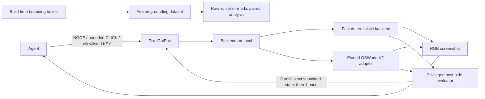

# PixelGym-OSWorld

PixelGym-OSWorld is a Gymnasium-compliant, pixel-only GUI environment on OSWorld-V2 with
bounded clicks and keystrokes, exact host-side sparse rewards, deterministic seeded task
generation, and stored validation evidence for a synthetic vendor-onboarding workflow.


## Results at a glance

| Check | Stored result | Evidence |
|---|---|---|
| Real OSWorld episode | 112 actions; reward `1.0` once on the terminal submission | [`real-golden-episode.json`](artifacts/day-2/raw/real-golden-episode.json) |
| Fake reset repeatability | 10/10 semantically and bitwise identical; 0 differing pixels | [`validation-report.json`](artifacts/validation-report.json) |
| Historical real reset stability | 5/5 semantically exact; at most 155 clock-region pixels differed; minimum SSIM 0.999863 | [`validation-report.json`](artifacts/validation-report.json) |
| 2026-09-06 real reset stability | 5/5 semantically and bitwise identical at 1024×768 on one local Docker host; portability is not established | [`real-reset.json`](artifacts/day-2-rev-2026-09-06-issues-95-101/raw/real-reset.json) |
| Reward timing | 122/122 stored trajectories met their expected reward/termination outcome | [`reward-timing.json`](artifacts/day-2/raw/reward-timing.json) |
| Space integrity | Gymnasium checker; 500 sampled actions; 14 invalid and 4 boundary probes | [`space-integrity.json`](artifacts/day-2/raw/space-integrity.json) |
| Reward-hacking audit | 14/14 surfaces have evidence and a classified disposition | [`reward-hacking.json`](artifacts/day-2-rev-2026-09-06-issues-95-101/raw/reward-hacking.json) |
| Grounding experiment | Raw 56/100; marks 100/100; +44.0 points, paired bootstrap 95% CI [+35.0, +54.0] | [`grounding-results.json`](artifacts/grounding-results.json) |

The project owner reviewed the historical Day 2 evidence and declared that gate `PASS`. Automated
status is not substituted for the human verdict. That historical reset result is semantic, **not
bitwise visual**. The 2026-09-06 revision records five bitwise-identical frames on one local Docker
host, which does not establish bitwise portability; see [Limitations](#limitations).

## Grounding benchmark

The frozen benchmark contains 100 examples: 20 task seeds across five screen states and ten control
targets. Raw-coordinate and set-of-marks conditions use the same target instruction. Candidate
generation is target-agnostic, overlays are deterministic, and proposal coverage is reported
separately from conditional mark-selection accuracy
([frozen dataset](artifacts/grounding-dataset.jsonl)).

The frozen v1 allocation perfectly aliases target identity with screen state: every target appears
in only one state. Control-type breakdowns for the stored v1 result are therefore descriptive
compositions, not independently identified control-type effects. Benchmark v2 fixes that design
for future evaluation with a separate 100-example crossed allocation: every target appears in every
screen state with two seed replicates per target-by-state cell. V2 reuses the target-neutral v1
captures and overlays, has not been run against a model, and does not change the reported v1 result
([v2 protocol](artifacts/grounding-v2-protocol.md),
[v2 manifest](artifacts/grounding-v2-manifest.json)).

Using Codex CLI with `gpt-5.4-mini` on 2026-08-10, raw-coordinate accuracy was **56/100
(56.0%)** and set-of-marks accuracy was **100/100 (100.0%)**. The paired difference was **+44.0
percentage points**, with a fixed-seed paired-bootstrap 95% CI of **[+35.0, +54.0]** and a
two-sided exact McNemar p-value of **1.137×10⁻¹³**. Proposal coverage was **100/100**; conditional
mark-selection accuracy was also **100/100**
([grounding results](artifacts/grounding-results.json)).


This is a measured result for one model alias, synthetic task family, prompt, layout, and screen
size. It supports the paired effect of adding these frozen overlays in this setup; it does not
establish why predictions changed or generalize to other GUI tasks. The manually reviewed 44 raw
errors included 31 wrong-semantic-element labels, 6 just-outside labels, and 7 coordinate-scaling
labels treated explicitly as reviewer inference. Labels are non-exclusive
([review decisions](artifacts/grounding-error-review-decisions.json)).

Offline reproduction makes no model or network calls:

```bash
python scripts/generate_grounding_report.py
```

The recorded run used the Codex CLI provider and current Codex login. An implemented but unused
OpenRouter alternative reads configuration only from the process environment:

```bash
export OPENROUTER_API_KEY="..."
export OPENROUTER_MODEL="provider/model-id"

python scripts/run_grounding_evaluation.py \
  --provider openrouter --full --max-new-calls 0 --plan-only
```

`OPENROUTER_MODEL` must select an image-capable route with structured-output support. The adapter
uses strict JSON Schema, requires routed parameter support, and enables neither response healing nor
hidden retries. See OpenRouter's official
[image-input](https://openrouter.ai/docs/guides/overview/multimodal/image-understanding) and
[structured-output](https://openrouter.ai/docs/guides/features/structured-outputs) documentation.

## v5 agent benchmark (in progress)

V5 is a separate protocol that evaluates a complete versioned policy system — model, prompt,
memory, harness, parser, and coordinate adapter — end to end on stateful workflows, after the v4c
pilot saturated at the episode level. It preserves the pixel-only observation, bounded action,
privileged evaluator, and sparse reward contracts described below
([v5 plan](plans/grounding-v5-agent-benchmark.md)).

**Calibration is incomplete and no v5 result is a benchmark score.** One policy slot has retained
evidence, and it did not complete its 50 assigned tasks. Unattempted assignments are retained in the
denominator rather than dropped:

| Policy slot | Assigned | Attempted | Exact success | Stop reason | Evidence |
|---|---:|---:|---|---|---|
| `B-qwen-stateful-v2` | 50 | 13 | 0 / 13 attempted (0.0%) | first invalid output, as the approved plan required; 37 unattempted | [report](artifacts/grounding-v5-d56-qwen-full-calibration-report.md) |

These are descriptive calibration numbers for one incomplete run. They are not a complete-run score,
not a confirmatory result, and not a milestone-gate verdict.

The `A-gemini-stateful-v2` calibration was **withdrawn**, and its evidence and reports were removed
from this repository rather than corrected in place. Its stored plan and run summaries recorded
absolute operator paths, which cannot be redacted without invalidating the SHA-256 values its own
integrity audit recorded for them, and no code path regenerates a run summary from its attempt
journal. That slot will be re-run from scratch under a new approval; until then this repository
makes no Gemini claim. The path defect itself is fixed at the producer
(`pixelgym/grounding/v5/evidence.py`), so a re-run records repository-relative paths.

The run's authoritative attempt journal holds raw provider responses, screenshots, and private
policy checkpoints. It is sealed as `must_not_commit` in the run's
`*-publication-relation.json` and is excluded from this repository by policy, enforced by
`tests/unit/test_restricted_evidence_excluded.py`. What is published instead is a
response-content-free derivative plus an integrity audit recording each authoritative artifact's
path and SHA-256:
[audit](artifacts/grounding-v5-d56-qwen-full-calibration-integrity-audit.json) ·
[derivative](artifacts/grounding-v5-d56-qwen-full-calibration-publishable.json). Every
non-restricted artifact the audit references is committed, so the recorded hashes can be checked
from a clone.

## Architecture



The observation is only an RGB screenshot. The evaluator reads privileged task state outside the
agent interface; expected values and bounding boxes never enter the environment observation or
`info`. Build-time grounding instrumentation is separate from the evaluation adapter.

## Platform milestone

The local-first platform wraps the frozen grounding workload with resumable evaluation, immutable
evidence storage, mechanical promotion gates, explicit human approval, exact-version serving, and
audited rollback. Its architecture keeps the control plane separate from MLflow metadata and the
authoritative immutable artifact store. See the [platform architecture](artifacts/platform/architecture.md)
and the [platform milestone plan](plans/grounding-evaluation-platform.md) for boundaries and
current scope.

### Local no-cost platform reproduction

The scripted lifecycle demo uses local services and a deterministic provider; its metrics are
synthetic governance fixtures, not model-quality evidence. It requires Docker and does not make
provider calls. From the repository root:

```bash
python3.12 scripts/platform_compose.py up --build --wait
```

Open the control plane at <http://localhost:5800> and MLflow at <http://localhost:5500>. Stop the
stack while retaining its local evidence with:

```bash
python3.12 scripts/platform_compose.py down
```

Both UI ports are bound to host loopback for this local demo. The control plane has CSRF
protection but no caller authentication; it must not be exposed or proxied onto a shared network.
Add authentication and authorization in front of both the control plane and MLflow before any
shared deployment.

Use this wrapper rather than invoking `docker compose` against `deploy/compose.yaml` directly: it
derives and bind-mounts the source-provenance file required to verify the packaged source. If a
previous direct invocation created a directory at `.cache/platform/source-provenance.json`, follow
the safe recovery steps in the [deployment guide](deploy/README.md#recover-a-directory-created-by-a-direct-compose-invocation).
The deployment guide also documents the separate fast, local-runtime, and isolated
Compose/Playwright test commands, their prerequisites, cleanup scope, and expected cold-run time.

The recorded lifecycle, generated API transcript, immutable-artifact verification, and known
limitations are available in the [demo script](artifacts/platform/demo-script.md),
[API transcript](artifacts/platform/demo-api-transcript.jsonl),
[integrity evidence](artifacts/platform/immutable-artifact-verification.json), and
[platform limitations](artifacts/platform/known-limitations.md). D4.12 remains a human-owned
milestone gate; this documentation does not declare it passed.

## Quick reproduction without OSWorld

Python 3.12 is required. The default development setup does not install OSWorld and the fast suite
does not need a VM, browser, network, or provider credentials.

```bash
python3.12 -m venv .venv
source .venv/bin/activate
pip install -e ".[dev]"

ruff check .
mypy pixelgym
pytest -q -n auto tests/unit
python scripts/golden_trajectory.py check
python scripts/demo_fake_backend.py --seed 7
```

The documented fast-suite target uses the `pytest-xdist` dependency included in the `dev` extra to
run independent tests in parallel. Serial execution remains supported but is not the under-one-minute
timing target. The editable install is sufficient for the fast suite, lint, and strict static type
check of the complete `pixelgym` package. Re-capturing the
frozen browser dataset additionally requires Playwright's Chromium binary, installed once with:

```bash
python -m playwright install chromium
python scripts/validate_vendor_form_browser_boundary.py \
  --output artifacts/local/browser-boundary.json
python scripts/capture_grounding_dataset.py
```

To revalidate the checked-in dataset, candidate records, image hashes, allocation summary, and
known design limitations without launching a browser or rewriting capture assets, run:

```bash
python scripts/capture_grounding_dataset.py --summary-only
```

To deterministically rebuild the balanced v2 metadata and audit sheets from the checked-in,
target-neutral v1 capture assets without any model calls, run:

```bash
python scripts/build_grounding_benchmark_v2.py
```

The scripted incomplete-submit demo stays at reward `0.0`. The separate golden trajectory checks
that all preceding rewards are zero, the exact valid submission pays `1.0` once, and the episode
terminates rather than truncates.

## Real OSWorld-V2 integration

The integration is pinned to OSWorld-V2 tag `v2026.06.24` at commit
`2b9b7b4eb73243d557bdbf2998fe18d8e18e19c6`. The historical Day 2 run used Python 3.12.13 and
1920×1080 screenshots. The 2026-09-06 revision used Python 3.12.14 and 1024×768 observations; both
used a digest-pinned native ARM64 QEMU host around the release's unchanged x86-64 guest. Full
provider and image metadata are recorded in the historical
[validation artifact](artifacts/validation-report.json) and the
[current revision](artifacts/day-2-rev-2026-09-06-issues-95-101/validation-report.json).

```bash
source .venv/bin/activate
pip install -e ".[osworld]"
python scripts/prepare_osworld_docker.py
python scripts/validate_vendor_form_browser_boundary.py \
  --output artifacts/local/browser-boundary.json
python scripts/smoke_osworld_reset.py
python scripts/osworld_space_smoke.py
python scripts/osworld_golden_trajectory.py check
python scripts/validate_day2.py real-resets
python scripts/validate_day2.py audit
python scripts/validate_day2.py assemble
python scripts/generate_validation_report.py
```

Preparation downloads the release's 14.2 GB compressed guest artifact. Apple Silicon still runs
the x86-64 guest without KVM; the recorded first expanded reset took 183.23 seconds
([validation evidence](artifacts/validation-report.json)).

## Environment contract

- Observation: an RGB `uint8` screenshot only.
- Actions: `NOOP`, bounded integer `CLICK(x, y)`, or `KEY(index)` into a versioned allowlist.
- Invalid actions: rejected before backend execution; coordinates are never clipped.
- Reward: `0.0` until one exact host-evaluated submission, then `1.0` exactly once.
- Episode end: success sets `terminated=True`; step limit sets `truncated=True`.
- Post-episode step: raises a clear error.
- Reset: same seed produces the same canonical task, task hash, and initial application state and
  clears prior submissions.

These behaviors are exercised by the stored
[validation report](artifacts/validation-report.json) and fast test suite.

## Reward-hacking audit

The stored audit covers 14 surfaces, including self-declared completion, incomplete submission,
visible fake success text, stale task identity, repeated submission, coordinate violations,
post-episode calls, modifier/devtools access, direct navigation, action mutation after validation,
and termination/truncation confusion. Each is classified as `blocked`, `tested`, `mitigated`, or a
known limitation, with the underlying evidence retained
([reward-hacking evidence](artifacts/day-2-rev-2026-09-06-issues-95-101/raw/reward-hacking.json)).

## Limitations

- This is one deterministic synthetic form, not a broad desktop-task distribution.
- The current app-mode reset evidence records five mutually bitwise-identical 1024x768 frames,
  without a mask or tolerance. That single local-Docker run does not establish bitwise portability
  across hosts. The retained `04b` navigation-boundary frame was captured before page
  initialization completed because the guest launch did not prove the page-ready sentinel before
  accepting the observation. The launch now waits for that sentinel, and the replacement `04c`
  comparison records the resulting raw pixel count and maximum channel delta before any separately
  named similarity metric. The immutable historical evidence also retains its earlier live-clock
  differences
  ([current comparison](artifacts/day-2-rev-2026-09-06-issues-95-101/raw/renderer-screenshot-differences.json)).
- The Apple Silicon path uses software emulation for the released x86-64 guest and is slow.
- Digest pinning mitigates mutable runtime tags; it does not eliminate third-party publisher risk.
- The privileged state endpoint exists inside the guest. The guest Chromium app-mode contract removes
  address-bar, tab, and desktop navigation affordances from the tested bounded-click observation;
  containment against a browser or guest OS exploit remains outside the threat model.
- The grounding model identifier may be a moving alias rather than an immutable snapshot.
- Target identity is perfectly aliased with screen state in the frozen v1 grounding dataset, so
  v1 control-type slices cannot separate control-type and screen-state effects. The unrun v2
  allocation crosses every target with every state, with only two seed replicates per cell.
- The grounding experiment covers one model, prompt, resolution, synthetic application layout, and
  target-agnostic candidate generator; its result should not be generalized beyond that scope.

## Project evidence

- [`artifacts/validation-report.md`](artifacts/validation-report.md) — generated Day 2 report
- [`artifacts/day-2/real-golden/contact-sheet.png`](artifacts/day-2/real-golden/contact-sheet.png) — real episode frames
- [`artifacts/grounding-protocol.md`](artifacts/grounding-protocol.md) — frozen experiment protocol
- [`artifacts/grounding-dataset.jsonl`](artifacts/grounding-dataset.jsonl) — frozen 100-example dataset
- [`artifacts/grounding-report.md`](artifacts/grounding-report.md) — reproducible paired analysis
- [`artifacts/grounding-v2-protocol.md`](artifacts/grounding-v2-protocol.md) — crossed v2 design
- [`artifacts/grounding-v2-manifest.json`](artifacts/grounding-v2-manifest.json) — validated v2 allocation and input/output hashes
- Incomplete v5 calibration reports, response-content-free derivatives, and stored-evidence
  integrity audits are linked from
  [v5 agent benchmark (in progress)](#v5-agent-benchmark-in-progress) above, with their coverage
  limits stated there.

## Sprint plans

- [`plans/sprint-1-environment-core.md`](plans/sprint-1-environment-core.md)
- [`plans/sprint-2-osworld-integration-and-validation.md`](plans/sprint-2-osworld-integration-and-validation.md)
- [`plans/sprint-3-grounding-and-portfolio.md`](plans/sprint-3-grounding-and-portfolio.md)
- [`plans/grounding-evaluation-platform.md`](plans/grounding-evaluation-platform.md)
- [`plans/grounding-v5-agent-benchmark.md`](plans/grounding-v5-agent-benchmark.md)

## License

Copyright 2026 Michael Swailes. Licensed under the Apache License, Version 2.0. See
[`LICENSE`](LICENSE) and [`NOTICE`](NOTICE).
