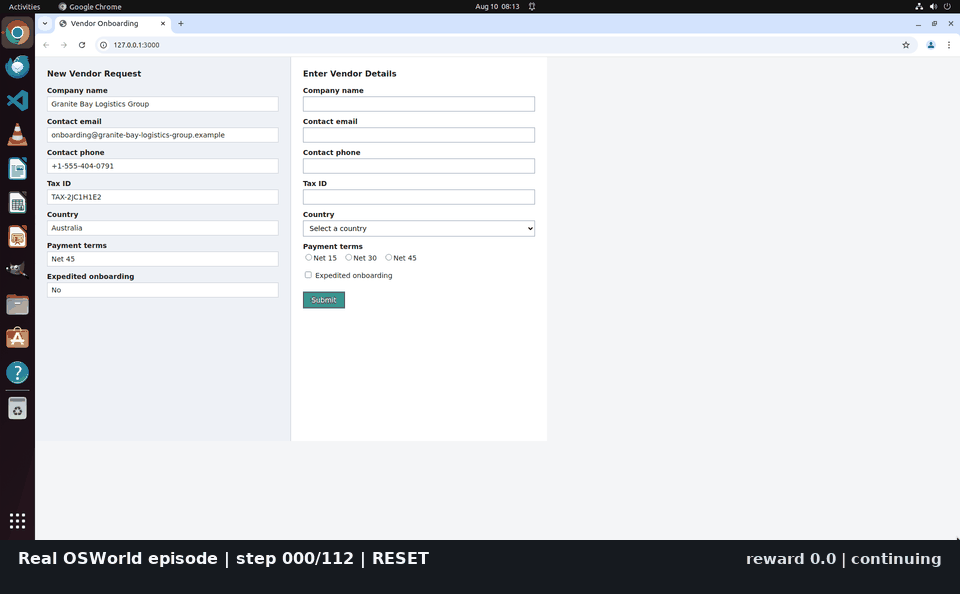
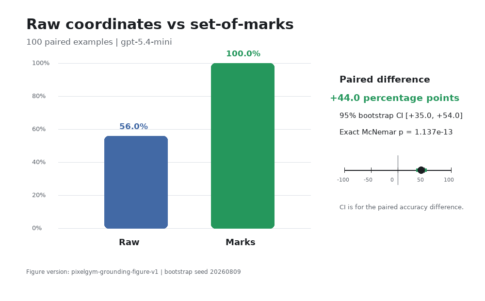
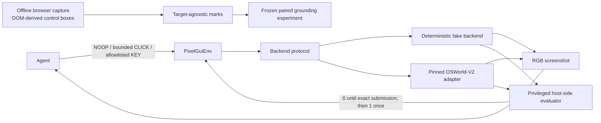

# PixelGym-OSWorld

PixelGym-OSWorld combines a pixel-only Gymnasium environment with a GUI-grounding benchmark for
one deterministic synthetic vendor-onboarding form and an optional backend pinned to OSWorld-V2.
It is built to make environment contracts, reward timing, reset behavior, and grounding evidence
inspectable—not to claim broad desktop-agent performance.

[](https://github.com/elanthus/OSWorldTasks/actions/workflows/ci.yml) [](LICENSE) 

## At a glance

- Pixel-only Gymnasium environment with a privileged evaluator; five bitwise identical real OSWorld resets at 1024×768 on one host ([reset evidence](artifacts/day-2-rev-2026-09-06-issues-95-101/raw/real-reset.json)).
- 100 paired examples (10 target controls x 10 seeds): 56/100 raw, 100/100 marks, +44.0 percentage points, example-level 95% CI [+35.0, +54.0] (target-clustered 95% CI [+21.0, +67.0], [supplement](artifacts/grounding-clustered-analysis-v1.md)); marks are selection among 10 labelled candidates with proposal coverage 100% by the retention rule ([protocol](artifacts/grounding-protocol.md)); moving `gpt-5.4-mini` alias, DOM-derived offline marks ([current report v2](artifacts/grounding-report-v2.md), [frozen original v1 report](artifacts/grounding-report.md), [capture implementation](pixelgym/grounding/capture.py)).
- Documented reproduction workflow: ruff, strict mypy, offline unit tests, and a non-mutating grounding-evidence verifier ([reproduction guide](docs/reproduction.md)).





## Quickstart

Python 3.12 is required. The default development install excludes OSWorld. From the repository
root:

```bash
python3.12 -m venv .venv
.venv/bin/pip install -e ".[dev]"
.venv/bin/ruff check .
.venv/bin/mypy pixelgym
.venv/bin/pytest -q -n auto tests/unit
.venv/bin/python scripts/golden_trajectory.py check
.venv/bin/python scripts/verify_grounding_report.py
```

The unit suite is offline: it does not bind sockets or require a browser, Docker, OSWorld, provider
credentials, or external services. The grounding verifier reads frozen evidence, recomputes the
headline, verifies stored hashes, and leaves tracked files unchanged. Numerical recomputation is
supported; cross-platform byte-for-byte PNG regeneration is not claimed
([verification guide](docs/grounding-verification.md)).

The real-loopback HTTP contract tests are a separate local integration group. Optional OSWorld,
browser capture, local Metaflow/MLflow runtime, and Docker/Playwright lifecycle commands are also
documented separately with their prerequisites ([reproduction guide](docs/reproduction.md),
[deployment guide](deploy/README.md#test-suite-boundaries)). Pull-request CI runs the offline unit
suite and the loopback HTTP group in separate jobs; the branch-protected `Fast suite` result
requires both. The manually dispatched platform workflow runs only the Metaflow/MLflow runtime
tests; it does **not** run the Docker/Playwright lifecycle suite
([CI](.github/workflows/ci.yml), [manual workflow](.github/workflows/platform-integration.yml)).

## Status

| Area | State | Record |
| --- | --- | --- |
| Environment and validation | Done | Sprint 1 gate ([D1.8](artifacts/decisions/d1.8.json)), Sprint 2 gate ([D2.11](artifacts/decisions/d2.11.json)) |
| Grounding v1 experiment | Done, frozen | Sprint 3 gate ([D3.11](artifacts/decisions/d3.11.json)) |
| Platform scripted lifecycle | Done for the scripted provider at revision 4c4a7fb | Milestone 4 platform gate ([D4.12](artifacts/decisions/d4.12.json)) |
| Grounding v2 crossed allocation | Designed, not run against a model | [v2 manifest](artifacts/grounding-v2-manifest.json) |
| v5 agent benchmark and calibration | In progress; v5 benchmark verdict (D5.10) not declared | [v5 design](docs/v5-benchmark-design.md), [evidence index](docs/evidence-index.md) |
| v5 stateful serving | In progress | [Platform design](docs/platform-design.md#v5-stateful-serving-apiv2) |

## Problem

GUI-agent evaluations can look successful while leaking privileged state, accepting invalid
actions, paying reward at the wrong time, or hiding failures in aggregate metrics. Broad desktop
benchmarks also make those boundaries expensive to isolate. This project narrows the workload to
one fixed form so each behavior can be specified, tested, and tied to stored evidence.

The main questions are:

- Can an agent interact through screenshots and a small, validated action vocabulary while a
  separate host-side evaluator controls reward?
- Does the same seed reproduce the same task and application state?
- On this fixed layout, how does raw coordinate prediction compare with a deterministic
  set-of-marks condition when proposal provenance and scoring are disclosed?

## Architecture


```mermaid
flowchart LR
    A["Agent"] -->|"NOOP / bounded CLICK / allowlisted KEY"| E["PixelGuiEnv"]
    E --> B["Backend protocol"]
    B --> F["Deterministic fake backend"]
    B --> O["Pinned OSWorld-V2 adapter"]
    F --> S["RGB screenshot"]
    O --> S
    S --> A
    F --> V["Privileged host-side evaluator"]
    O --> V
    V -->|"0 until exact submission; then 1 once"| E
    D["Offline browser capture<br/>DOM-derived control boxes"] --> M["Target-agnostic marks"]
    M --> G["Frozen paired grounding experiment"]
```

At runtime, the environment exposes only an RGB screenshot. The agent can issue `NOOP`, bounded
integer `CLICK(x, y)`, or `KEY(index)` actions from a versioned allowlist. Expected answers,
bounding boxes, DOM data, and evaluator diagnostics do not enter the observation or `info`.
Invalid actions are rejected before backend execution, and the privileged evaluator is the only
source of success ([environment](pixelgym/env.py), [actions](pixelgym/actions.py),
[evaluator](pixelgym/evaluator.py)).

The grounding dataset has a separate, offline build path. Browser instrumentation records control
geometry while constructing frozen evaluation assets; that instrumentation is not reachable from
the environment adapter ([capture](pixelgym/grounding/capture.py),
[protocol](artifacts/grounding-protocol.md)).

## Completed result

### Pixel-only environment and validation

The implemented environment supports the fake backend for fast contract tests and the pinned
OSWorld-V2 adapter for real episodes. For seed 7, **five real OSWorld resets were semantically and
bitwise identical at 1024×768 on one local Apple Silicon Docker/QEMU host**
([reset evidence](artifacts/day-2-rev-2026-09-06-issues-95-101/raw/real-reset.json),
[revision environment](artifacts/day-2-rev-2026-09-06-issues-95-101/validation-report.json)). The
reward-hacking audit records a disposition and evidence for **14 surfaces (11 tested, 2 blocked, 1 mitigated)**
([audit](artifacts/day-2-rev-2026-09-06-issues-95-101/raw/reward-hacking.json)); a later
[addendum](artifacts/reward-hacking-addendum-2026-09.json) records one more surface, precomputing
answers from the task ID, as mitigated by replacing it in `info` with an opaque episode ID. The historical
1920×1080 run established semantic task-state determinism and perceptual visual stability, not
bitwise equality ([historical reset evidence](artifacts/day-2/raw/real-reset.json)).

The environment contract is sparse and explicit: reward remains `0.0` until an exact valid
submission, becomes `1.0` exactly once, and terminates the episode; a step-limit ends by
truncation, and stepping after either ending raises an error
([validation report](artifacts/validation-report.json)).

### Frozen grounding experiment

On **100 paired examples (10 target controls x 10 seeds)** from the same 1024×768 synthetic form, the Codex CLI provider using the
moving `gpt-5.4-mini` alias scored **56/100 with raw coordinates and 100/100 with marks**. The
paired difference was **+44.0 percentage points**, with a fixed-seed percentile-bootstrap **95% CI
of [+35.0, +54.0]** ([current report v2](artifacts/grounding-report-v2.md) with
[its provenance](artifacts/grounding-report-provenance-v2.json),
[frozen original v1 report](artifacts/grounding-report.md),
[structured results](artifacts/grounding-results.json),
[provenance](artifacts/grounding-report-provenance-v1.json)). That interval treats the 100 examples
as independent; resampling the 10 target controls instead gives a target-clustered 95% CI of
[+21.0, +67.0], and 7 of 10 targets favour marks with none favouring raw (exact sign test
p = 0.0156) ([clustered supplement](artifacts/grounding-clustered-analysis-v1.md)). Proposal
coverage was **100/100**, which holds by construction: the retention rule requires the target to
occur exactly once among the independently collected candidates
([protocol, retention rule](artifacts/grounding-protocol.md#retention-validation-and-exclusions)).
The marks condition is therefore selection among 10 labelled candidates, and conditional
mark-selection accuracy was **100/100**; the two quantities are reported separately in the same
evidence.

The marks condition is not an end-to-end pixel-only proposal system. During offline dataset
construction, Playwright evaluates `getBoundingClientRect()` for every actionable control and
stores those DOM-derived locations before the requested target is joined. The overlay generator
marks all candidates without consulting the target. The model sees the marked screenshot and
instruction, returns a `mark_id`, and the evaluation adapter supplies the center coordinates of
that candidate's stored box ([capture implementation](pixelgym/grounding/capture.py),
[adapter implementation](pixelgym/grounding/evaluation.py),
[leakage controls](artifacts/grounding-protocol.md#set-of-marks-leakage-controls)). This offline
proposal provenance is distinct from the screenshot-only environment interface described above.

### Supporting platform work and status

A local-first evaluation and policy-delivery layer rehearses resumable execution, evidence
retention, mechanical promotion gates, explicit approval, exact-version serving, and rollback on
the frozen workload. Its measurements use a deterministic `scripted-demo` provider and are
synthetic orchestration fixtures—not model-quality, production-throughput, or deployment evidence
([platform architecture](artifacts/platform/architecture.md),
[platform evidence](artifacts/platform/seed-policy-fanout-evidence-v1.json)). The control plane has
no caller authentication; it and the MLflow demo UI must remain on loopback and must not be exposed
or proxied onto a shared network ([deployment warning](deploy/README.md)).

The owner-recorded [D1.8](artifacts/decisions/d1.8.json),
[D2.11](artifacts/decisions/d2.11.json),
[D3.11](artifacts/decisions/d3.11.json), and
[D4.12](artifacts/decisions/d4.12.json) decisions remain in the audit trail. D4.12 applies only
to its reviewed revision and scripted-provider scope. The v5 confirmatory benchmark and v5
milestone gate remain incomplete; retained calibration, negative results, and unfinished work are
documented without being promoted to a headline result
([v5 design](docs/v5-benchmark-design.md), [evidence index](docs/evidence-index.md)).

## Limitations

- The environment and grounding result cover one deterministic synthetic form at one 1024×768
  layout. They do not establish broad GUI or cross-application generalization
  ([grounding report](artifacts/grounding-report.md#limitations)).
- `gpt-5.4-mini` was a moving provider alias, not an immutable model snapshot. The result is bound
  to the recorded provider, prompt, data, and collection window
  ([provenance](artifacts/grounding-report-provenance-v1.json)).
- The frozen v1 allocation perfectly aliases target identity with screen state. Control-type
  slices are descriptive; the crossed v2 allocation has not been run against a model
  ([v2 protocol](artifacts/grounding-v2-protocol.md),
  [v2 manifest](artifacts/grounding-v2-manifest.json)).
- Marks rely on target-agnostic but DOM-derived offline proposals and fixed-layout center mapping.
  The result measures selection given that proposal mechanism, not proposal generation from pixels
  or end-to-end task completion ([protocol](artifacts/grounding-protocol.md)).
- Bitwise visual repeatability was observed on one host. Cross-host portability is not established;
  the historical run supports only semantic determinism and perceptual visual stability
  ([visual differences](artifacts/day-2-rev-2026-09-06-issues-95-101/raw/renderer-screenshot-differences.json)).
- The privileged state endpoint exists inside the guest. App-mode navigation containment was
  tested, while browser and guest-OS exploits remain outside the threat model. Digest pinning does
  not remove third-party publisher risk ([reward-hacking audit](artifacts/day-2-rev-2026-09-06-issues-95-101/raw/reward-hacking.json)).
- The +44 pp result is specific to `gpt-5.4-mini` with prompt v1. With a revised prompt, Claude
  Haiku 4.5 scored 100/100 raw on the same 100 examples
  ([v3 Haiku/Gemini report](artifacts/grounding-v3-haiku-gemini-report.md)).
- The headline calls ran through the Codex CLI harness and averaged about 11,900 input tokens per
  screenshot-plus-instruction ([clustered supplement](artifacts/grounding-clustered-analysis-v1.md),
  derived from [predictions](artifacts/grounding-predictions.jsonl)). The harness
  prompt is not part of the recorded prompt v1, and it is not recorded whether the harness prompt
  was identical across conditions.
- Platform metrics are synthetic, local scripted-provider measurements. V5 calibration is
  descriptive, the confirmatory benchmark is unfinished, and no v5 gate is declared
  ([evidence index](docs/evidence-index.md)).

## Related work and demonstrated contribution

[OSWorld](https://proceedings.neurips.cc/paper_files/paper/2024/hash/5d413e48f84dc61244b6be550f1cd8f5-Abstract-Datasets_and_Benchmarks_Track.html)
introduced a real-computer environment with task setup and execution-based evaluation across
desktop operating systems. This project uses the pinned OSWorld-V2 release as an optional backend;
it does not claim to originate OSWorld or reproduce the breadth of its benchmark. Its demonstrated
environment contribution is a narrow Gymnasium-compatible, screenshot-only interface, a custom
deterministic task, a privileged evaluator boundary, and stored validation evidence for the
contracts above.

[Set-of-Mark Prompting](https://arxiv.org/abs/2310.11441) introduced the visual-prompting pattern of
overlaying regions with referable marks. This project adapts that pattern to a fixed synthetic GUI
using offline DOM-derived control boxes instead of the paper's segmentation-based proposal path.
Its demonstrated research-engineering contribution is the frozen paired comparison, explicit
target-agnostic proposal controls, separate proposal/selection metrics, retained failures, and a
non-mutating evidence verifier. It is not a new foundation model, a general GUI-proposal method, or
a broad agent benchmark.

## Evidence and project history

- [Evidence index](docs/evidence-index.md) — canonical claims, historical records, withdrawals,
  and public-verification limits.
- [Reproduction guide](docs/reproduction.md) — offline, loopback, browser, and OSWorld commands.
- [Environment contract](docs/environment-contract.md) — the fifteen invariants and where they
  are enforced.
- [Platform design](docs/platform-design.md) — Milestone 4 platform and v5 stateful serving.
- [v5 benchmark design](docs/v5-benchmark-design.md) — contract, analysis plan, and current status
  of the unfinished benchmark.
- [Development process](docs/development-process.md) — branch, review, and human-gate process,
  including defects that escaped review.
- [Glossary](docs/glossary.md) — D-numbers, grounding versions, and codenames.

## Contributing

Read [AGENTS.md](AGENTS.md) before changing code or evidence. Preserve the screenshot-only,
host-evaluated reward, determinism, and build-time-instrumentation boundaries; keep OSWorld optional
for the fast path; version corrections to frozen evidence instead of silently rewriting history;
and report only checks actually run. Open review-ready pull requests by default. Human-owned gates
remain human decisions.

## Development process

[AGENTS.md section 4](AGENTS.md#4-human-gates--stop-and-ask) reserves scope changes, milestone
gates, provider and cloud spend, paid model calls, and public claims for a human decision. Coding
agents implemented, tested, and prepared evidence on branches and pull requests; deterministic
checks and independent review ran separately. The
[development process record](docs/development-process.md) lists the defects review caught and the
ones that escaped it.

## License

Copyright 2026 Michael Swailes. Licensed under the Apache License, Version 2.0. See
[`LICENSE`](LICENSE) and [`NOTICE`](NOTICE). Bundled DejaVu fonts retain their separate notices and
license terms listed in `NOTICE`.
