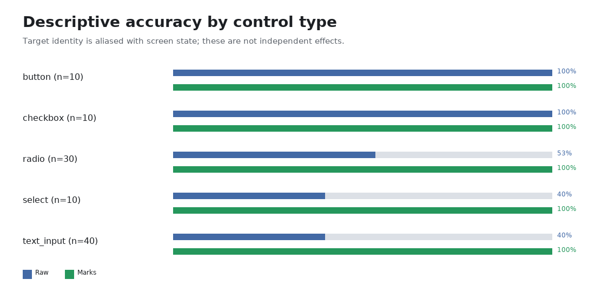

# PixelGym Grounding Experiment

- Protocol: `pixelgym-grounding-v1`
- Prompt: `pixelgym-grounding-prompt-v1`
- Provider/model: `codex-cli` / `gpt-5.4-mini`
- Collection window: 2026-08-10T07:06:26.396148+00:00 to 2026-08-10T08:05:49.250812+00:00
- Sample: 100 examples, 200 condition records, 0 exclusions

## Main result

Raw-coordinate accuracy was **56/100 (56.0%)**. Set-of-marks accuracy was **100/100 (100.0%)**. The paired difference was **+44.0 percentage points** with a percentile-bootstrap 95% CI of **[+35.0, +54.0]** and a two-sided exact McNemar p-value of **1.137e-13**.


This estimates the paired effect of adding the frozen marks overlay for this model, task family, prompt, and capture setup. It does not establish a mechanism or generalize to other GUI tasks or models.

## Proposal coverage and conditional selection

Proposal coverage was **100/100 (100.0%)**. Conditional on the target being proposed, mark-selection accuracy was **100/100 (100.0%)**. These are reported separately; selection accuracy does not absorb proposal failures.

## Data integrity and output failures

Invalid output rates were raw=0.0% and marks=0.0%. Request-failure rates were raw=0.0% and marks=0.0%. Invalid outputs and request failures remain in the denominator and score as incorrect. No examples were excluded.

## Slices



**Design limitation:** target identity and screen state are perfectly aliased in the frozen capture grid: each target appears in exactly one of the five screen states. The control-type rows below are descriptive compositions only; differences cannot be attributed independently to control type rather than screen state.

| Element type | n | Raw | Marks | Delta (pp) |
|---|---:|---:|---:|---:|
| button | 10 | 100.0% | 100.0% | +0.0 |
| checkbox | 10 | 100.0% | 100.0% | +0.0 |
| radio | 30 | 53.3% | 100.0% | +46.7 |
| select | 10 | 40.0% | 100.0% | +60.0 |
| text_input | 40 | 40.0% | 100.0% | +60.0 |

| Target size | n | Raw | Marks | Delta (pp) |
|---|---:|---:|---:|---:|
| medium | 50 | 40.0% | 100.0% | +60.0 |
| small | 50 | 72.0% | 100.0% | +28.0 |

## Normalized center distance

For parsed raw points, screenshot-diagonal-normalized center distance had mean 0.1248, median 0.0320, and p90 0.4301. The marked condition had mean 0.0000; valid selected marks are converted to their candidate centers by the frozen scoring rule, so a correct marked selection has distance zero by construction.

## Error review

All error labels were manually inspected.

| Category | Error records |
|---|---:|
| coordinate scaling error | 7 |
| correct region but point just outside the box | 6 |
| crowded or overlapping controls | 14 |
| small target | 14 |
| wrong semantic element | 31 |

Categories are non-exclusive, so their counts can sum above the 44 error records. The 7 coordinate-scaling labels are a reviewer inference from horizontal alignment and displacement, not proof of the causal mechanism.

## Representative examples

- `marks_win` — `vendor-form-0001-company-name`: [artifacts/grounding/gallery/marks_win-vendor-form-0001-company-name.png](./grounding/gallery/marks_win-vendor-form-0001-company-name.png)
- `marks_win` — `vendor-form-0005-country`: [artifacts/grounding/gallery/marks_win-vendor-form-0005-country.png](./grounding/gallery/marks_win-vendor-form-0005-country.png)
- `marks_win` — `vendor-form-0007-payment-terms-net-30`: [artifacts/grounding/gallery/marks_win-vendor-form-0007-payment-terms-net-30.png](./grounding/gallery/marks_win-vendor-form-0007-payment-terms-net-30.png)
- `unchanged_correct` — `vendor-form-0002-contact-email`: [artifacts/grounding/gallery/unchanged_correct-vendor-form-0002-contact-email.png](./grounding/gallery/unchanged_correct-vendor-form-0002-contact-email.png)
- `unchanged_correct` — `vendor-form-0006-payment-terms-net-15`: [artifacts/grounding/gallery/unchanged_correct-vendor-form-0006-payment-terms-net-15.png](./grounding/gallery/unchanged_correct-vendor-form-0006-payment-terms-net-15.png)
- `raw_win` — none observed (raw correct, marks incorrect).
- `unchanged_incorrect` — none observed (both conditions incorrect).

## Latency and usage

The 200 of 200 stored calls with latency evidence took 1585.7 seconds in aggregate provider latency (median 5402.2 ms). Usage fields are summed exactly as returned by the provider in `grounding-results.json`; they are not converted into a monetary estimate.

## Limitations

- One synthetic vendor-onboarding task family, one resolution, and one model were used.
- Target identity is perfectly aliased with screen state in the frozen dataset, so control-type slices are descriptive and do not identify a control-type effect.
- The model name may be a moving provider alias rather than an immutable snapshot.
- Candidate generation is deterministic and target-agnostic, but the resulting overlays are specific to this fixed application layout.
- A paired observational result supports the effect of the overlay intervention in this setup; it does not prove why an error changed.
- Bootstrap intervals describe uncertainty over this frozen example set, not over all possible applications or model versions.

## Offline reproduction

No model or network calls are made by this command:

```bash
.venv/bin/python scripts/generate_grounding_report.py
```

Inputs are the frozen dataset, overlays, immutable paired predictions, and manually reviewed error taxonomy. Their SHA-256 digests are recorded in `grounding-results.json` together with every example-level outcome and the fixed analysis configuration.
