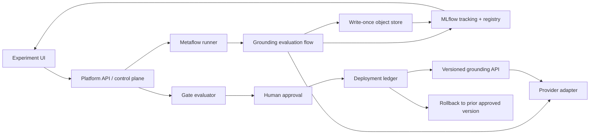
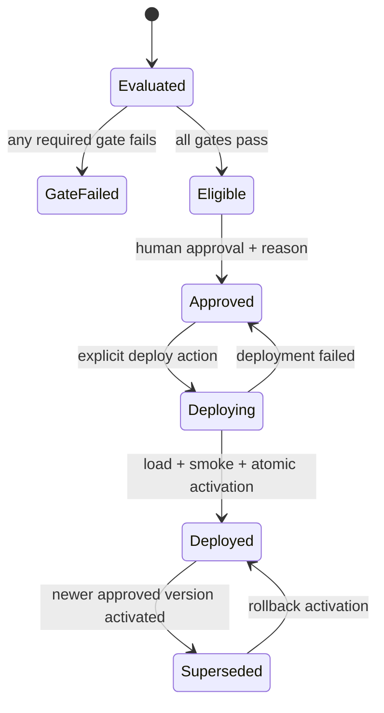

# Milestone 4 — Grounding Evaluation and Policy Delivery Platform

**Status: IN PROGRESS — D4.1 demo policy approved and frozen on 2026-08-14.** The
approval is recorded in
[`artifacts/platform/human-approvals.json`](../artifacts/platform/human-approvals.json). It covers
only the synthetic local demo and 30-day local governance retention. It does not authorize paid
model calls, production WORM retention, external deployment, or new public claims; those remain
separate human gates.

## Outcome

Build a small, local-first platform around the frozen Day 3 GUI-grounding workload. The platform
should:

- Run grounding evaluations as resumable Metaflow flows.
- Record the dataset, prompt, provider model, inference settings, code revision, metrics, latency,
  cost, and output artifacts in MLflow.
- Provide a focused web UI for submitting experiments and comparing compatible runs.
- Evaluate accuracy, cost, and latency gates mechanically and fail closed when evidence is missing.
- Require a separate human approval after all automated gates pass.
- Package and serve the approved grounding policy through a versioned HTTP API.
- Roll back atomically to the previous approved deployment.
- Preserve raw provider responses and dataset snapshots with content hashes and write-once storage.

The reviewer-facing demo is one complete lifecycle:

> Submit experiment → inspect comparison → promotion blocked → revise prompt/model → thresholds
> pass → approve → deploy → invoke the versioned API → rollback.

This milestone adds a platform layer around the existing benchmark. It must not alter the Day 3
ground-truth boxes, silently repair model outputs, discard failures, or reinterpret the published
Day 3 result.

## Why this is a separate milestone

Day 3 answered an experimental question using a frozen paired dataset. This milestone demonstrates
the system that repeatedly executes, governs, and delivers that kind of experiment. The existing
artifacts are its first workload and compatibility fixture:

- [`artifacts/grounding-protocol.md`](../artifacts/grounding-protocol.md)
- [`artifacts/grounding-dataset.jsonl`](../artifacts/grounding-dataset.jsonl)
- [`artifacts/grounding-predictions.jsonl`](../artifacts/grounding-predictions.jsonl)
- [`artifacts/grounding-results.json`](../artifacts/grounding-results.json)

The published Day 3 result remains immutable. Platform runs get new run IDs, manifests, and
artifacts even when they replay the same dataset.

## Ownership legend

- **YOU** — Approve gate thresholds, provider/model choice, spend, eligible candidates,
  deployment, rollback rehearsal, retention policy, and public claims.
- **AGENT · medium** — Bounded adapters, UI views, schemas, API handlers, packaging, and routine
  tests.
- **AGENT · high** — Workflow idempotency, lineage, gate semantics, immutable storage,
  concurrency, promotion, deployment, and rollback correctness.
- **PAIR** — Agent prepares a run or demo; you inspect the evidence and perform approval actions.

Only one agent should write shared platform or migration paths at a time. Disjoint UI and test
fixtures may be developed in parallel after their interfaces are frozen.

## Scope

### MVP

- One repository, one grounding task family, one MLflow experiment, and one registered policy.
- Local Metaflow execution with a production-compatible flow definition.
- An MLflow tracking server backed by a relational database and S3-compatible artifact storage.
- A small server-rendered web UI; avoid a separate JavaScript build unless the interaction requires
  it.
- A deterministic no-cost provider for tests and the scripted lifecycle demo.
- The existing provider-neutral Day 3 adapter for explicitly approved real runs.
- One active deployment, an append-only deployment history, and rollback to the immediately
  previous approved version.
- A FastAPI serving process with a versioned request/response schema.
- Local Docker Compose for the demo stack, while pure unit tests remain network-free.

### Deliberate non-goals

- General-purpose model training, hyperparameter optimization, or a broad feature store.
- Multi-tenant SaaS, enterprise SSO, billing, or arbitrary user-supplied Python/Metaflow flows.
- Kubernetes, Argo Workflows, cloud autoscaling, canary traffic, or multi-region failover in the
  MVP.
- Automatic promotion or deployment immediately after a passing evaluation.
- Online learning, automatic rollback from production telemetry, or mutable production prompts.
- Replacing the full MLflow UI. The custom UI is a task-focused control plane and links to MLflow
  for detailed artifacts.
- Claiming that a deterministic demo-provider run is real model evidence.

## System invariants

These are acceptance criteria, not aspirations.

1. **Raw-before-score:** a provider response is durably written before it is parsed or scored.
2. **No hidden retries:** a wrong, invalid, or unparseable response is final. A transport failure
   before any response may be retried only under the existing Day 3 request rules.
3. **Content identity:** every dataset snapshot, image, prompt, raw response, prediction file, gate
   report, and policy manifest has a SHA-256 digest.
4. **Immutable authority:** raw responses and frozen dataset snapshots live under
   content-addressed keys in a versioned, write-once bucket. MLflow stores their pinned object
   version, URI, size, media type, and digest.
5. **No mutable inputs:** an evaluation resolves exact dataset, prompt, model, parser, scorer,
   overlay, and price-catalog versions before the first provider call.
6. **Bidirectional lineage:** each Metaflow run records its MLflow run ID; each MLflow run records
   the Metaflow pathspec.
7. **Compatible comparisons only:** the UI warns and disables promotion comparison when dataset
   fingerprint, scorer, target semantics, or primary metric differ.
8. **Fail closed:** missing usage, unknown price, missing latency, incomplete examples, dirty code
   when forbidden, or unverifiable artifacts fail the relevant gate.
9. **All gates are conjunctive:** accuracy **and** cost **and** latency must pass the same versioned
   gate policy. A favorable average cannot waive another failed gate.
10. **Human approval is distinct:** passing gates creates an eligible candidate; it never approves
    or deploys it.
11. **Exact-version serving:** a deployment pins an immutable policy version. The serving process
    does not resolve a moving alias on every request.
12. **Atomic pointer change:** deploy and rollback change the active deployment with a transactional
    compare-and-swap and append an audit event.
13. **Approved rollback only:** rollback may select only a previously approved, loadable, healthy
    policy version.
14. **Registry aliases are views:** MLflow aliases and tags mirror control-plane state but are not
    the authoritative approval or deployment ledger.
15. **Day 3 boundaries survive:** target boxes remain build-time data; expected answers never enter
    the served policy; invalid outputs remain visible and scored as incorrect.
16. **Secrets stay out of evidence:** credentials are injected at runtime and never enter Metaflow
    artifacts, MLflow params/tags, logs, raw-response envelopes, screenshots, or Git.

S3 Object Lock is the production reference for the immutable bucket because it uses a WORM model
to prevent protected object versions from being overwritten or deleted. See the official
[S3 Object Lock documentation](https://docs.aws.amazon.com/AmazonS3/latest/userguide/object-lock.html).
Application-level content addressing is still required so integrity does not depend on one storage
vendor.

## Architecture



### Component boundaries

**Metaflow** owns execution order, fan-out, joins, resume behavior, and task-level artifacts. A
single flow definition must run locally first. Metaflow supports persisted artifacts, code
snapshots, `foreach` fan-out, and production orchestrator integrations; use those capabilities
without making a production scheduler a prerequisite for the demo. References:
[Metaflow overview](https://docs.metaflow.org/introduction/what-is-metaflow),
[`foreach` flows](https://docs.metaflow.org/metaflow/basics), and
[failure handling](https://docs.metaflow.org/scaling/failures).

**MLflow** owns experiment metadata, parameters, metrics, dataset references, prompt versions,
policy packages, and browsable artifacts. Use a database-backed store because the Model Registry
requires it. Use exact model/prompt versions and model aliases rather than deprecated Registry
stages. References: [MLflow Tracking](https://mlflow.org/docs/latest/ml/tracking/),
[dataset tracking](https://mlflow.org/docs/latest/dataset/),
[Prompt Registry](https://mlflow.org/prompt-registry/), and
[Model Registry workflows](https://mlflow.org/docs/latest/ml/model-registry/workflow/).

**The control plane** owns experiment submissions, state transitions, gate decisions, approvals,
deployments, rollback history, and audit events. It reads MLflow through `MlflowClient` but does not
write directly to MLflow's internal database tables.

**The immutable store** owns the authoritative bytes for dataset snapshots, raw provider
responses, and signed-off manifests. MLflow's artifact store points at object storage, while every
authoritative reference also pins a digest and object version. MLflow documents the separation
between its metadata backend and artifact store in its
[artifact-store architecture](https://mlflow.org/docs/latest/self-hosting/architecture/artifact-store/).

**The serving API** loads one exact approved policy manifest at startup, completes a health check,
then atomically becomes active. It never serves a gate-failed, unapproved, or partially loaded
candidate.

## Proposed repository layout

```text
pixelgym/
├── grounding/                  # existing dataset, provider, scoring, and report code
└── platform/
    ├── contracts.py            # run, policy, gate, approval, deployment schemas
    ├── fingerprints.py         # canonical dataset and artifact hashing
    ├── immutable_store.py      # put-once/get-and-verify interface
    ├── mlflow_tracking.py      # MLflow logging and lookup adapter
    ├── policy.py               # exact prompt/model/parser/scorer policy manifest
    ├── gates.py                # pure fail-closed gate evaluation
    ├── control_store.py        # transactional control-plane repository
    ├── service.py              # versioned grounding inference service
    └── web/                    # experiment, comparison, approval, deployment views
flows/
└── grounding_evaluation_flow.py
config/
├── promotion-gates.schema.json
└── price-catalog.schema.json
deploy/
├── compose.yaml
└── README.md
scripts/
├── platform_demo.py
├── verify_immutable_artifacts.py
└── export_platform_evidence.py
tests/
├── unit/platform/
├── integration/platform/
└── fixtures/platform/
artifacts/platform/             # generated, reviewer-safe evidence only
```

Do not move or rewrite the current Day 3 files merely to fit this layout. The new package imports
the existing evaluator through a narrow adapter.

## Canonical identities

### Dataset fingerprint

MLflow's dataset digest is logged for UI lineage, but the platform's authoritative fingerprint is
a full SHA-256 over a canonical manifest:

1. Parse and schema-validate every JSONL record.
2. Normalize JSON as UTF-8 with sorted keys, stable separators, and no timestamps.
3. Sort records by `example_id` so semantically identical snapshots do not change identity because
   of line order.
4. Include the protocol version, capture version, coordinate convention, screen dimensions,
   example count, each canonical record hash, and each referenced raw/overlay image hash.
5. Hash the resulting canonical manifest and store both the manifest and digest.
6. Re-read stored bytes and verify every referenced asset before evaluation starts.

Any content mutation changes the fingerprint. File modification times, absolute local paths, and
object-store URLs do not participate in the digest.

### Policy version

A deployable policy is more than a provider model name. Its immutable manifest contains:

```json
{
  "schema_version": "pixelgym-grounding-policy-v1",
  "provider": "provider-id",
  "model": "exact-model-id-or-disclosed-alias",
  "prompt_name": "pixelgym-grounding",
  "prompt_version": 3,
  "prompt_sha256": "<sha256>",
  "condition": "raw-or-marks",
  "parameters": {},
  "parser_version": "...",
  "scorer_version": "...",
  "overlay_version": "...",
  "code_revision": "<git-commit>",
  "dependency_lock_sha256": "<sha256>"
}
```

The canonical manifest hash is `policy_id`. A provider alias may be recorded only when the
provider offers no immutable snapshot, and that limitation must appear in the gate report and UI.
The prompt is registered in MLflow, but the policy references its exact version and digest—not a
mutable prompt alias.

### Raw response envelope

Each condition call produces an envelope before parsing:

```json
{
  "schema_version": "pixelgym-raw-response-v1",
  "request_id": "<deterministic cache key>",
  "example_id": "...",
  "dataset_fingerprint": "sha256:...",
  "policy_id": "sha256:...",
  "request_sha256": "...",
  "started_at_utc": "...",
  "latency_ms": 0,
  "usage": {},
  "price_catalog_version": "...",
  "cost_usd": 0.0,
  "response_media_type": "application/json",
  "response_sha256": "...",
  "raw_response": {},
  "request_status": "responded"
}
```

Timestamps and latency are evidence fields but do not participate in request identity. If usage or
price is unavailable, store `null` plus a reason; never substitute zero. Provider payloads must be
redacted only by a versioned, tested rule that cannot remove the actual prediction. Preserve the
unredacted response only when it contains no credential or prohibited personal data.

## Metaflow evaluation flow

The initial flow should be explicit and inspectable:

```text
start
  → validate_and_freeze_inputs
  → create_or_recover_mlflow_run
  → build_shards
  → evaluate_shard (foreach)
  → join_responses
  → verify_raw_artifacts
  → parse_and_score
  → aggregate_metrics
  → evaluate_gates
  → finalize_mlflow_run
  → register_candidate
  → end
```

Key rules:

- Fan out deterministic shards, not one unconstrained task per example. Record shard membership and
  cap local concurrency with Metaflow's worker controls.
- Pure validation, parsing, scoring, and aggregation steps may use bounded Metaflow retries.
- A paid-provider step must be idempotent by deterministic request ID and immutable response lookup.
  Do not rely on blind workflow retry for exactly-once billing.
- On resume, reuse a raw response only after its request hash, response hash, dataset fingerprint,
  and policy ID all verify.
- One parent MLflow run represents the submitted experiment. Optional child runs may represent
  conditions or shards, but the comparison UI reads the complete parent summary.
- Finalize an incomplete or failed run with an explicit status and retained partial evidence. Never
  make a failed run disappear.
- Register a promotable candidate only after the parent MLflow run has finalized successfully. A
  failed or incomplete run must never leave an Eligible candidate behind.
- Commit candidate registration and the submission's `Complete` status in one control-store
  transaction, so either both become visible or neither does.
- The MLflow run ID and Metaflow pathspec are written as soon as both exist and reconciled if a
  process stops between those writes.

Metaflow notes that external side effects require special care under retries; its
[`@retry` documentation](https://docs.metaflow.org/api/step-decorators/retry) specifically warns
against retrying non-idempotent operations. Provider calls and registry updates must follow that
rule.

## MLflow run contract

Every parent experiment run logs the following. Names should be frozen in a schema file so UI code
does not depend on ad hoc strings.

| Category | Required fields |
|---|---|
| Dataset input | Name, authoritative fingerprint, MLflow digest, immutable manifest URI/version, schema, protocol version, example count |
| Prompt | Registry name, exact version, SHA-256, rendered-template schema |
| Model | Provider, exact identifier or alias disclosure, endpoint class, structured-output mode |
| Inference params | Temperature/reasoning setting, seed if supported, max output, condition, retry policy, concurrency |
| Code | Git commit, dirty flag, patch artifact when dirty, dependency-lock digest, Python version |
| Orchestration | Metaflow flow name, run ID/pathspec, attempt/resume metadata, submission ID |
| Accuracy metrics | Correct count, denominator, point accuracy, confidence bound, invalid rate, request-failure rate, proposal coverage, conditional mark-selection accuracy |
| Latency metrics | Per-response count, p50, p95, maximum, and end-to-end run duration; units in metric names |
| Cost metrics | Total USD, USD per example, USD per 100 examples, priced-call count, unpriced-call count, price-catalog version |
| Gate metrics | Threshold and observed value for each gate, pass/fail per gate, overall eligibility |
| Artifacts | Run manifest, raw-response index, parsed predictions, per-example scores, summary, gate report, environment manifest, policy package, representative images |

Use integer numerator/denominator fields in addition to floating-point accuracy. Compute p95 with a
frozen method and name the latency boundary precisely: elapsed monotonic time from provider request
dispatch until full response receipt. Record queue and end-to-end durations separately so they
cannot be confused with provider latency.

Cost is derived from provider usage and a versioned price catalog frozen at submission. If the
provider reports authoritative billed cost, retain both reported and calculated values and explain
any discrepancy. An unknown price or missing usage fails the cost gate.

MLflow supports run comparison, searchable metrics, code versions, dataset inputs, and artifacts in
its tracking API and UI. The custom UI should use those supported APIs rather than querying MLflow's
internal tables. See [MLflow Tracking](https://mlflow.org/docs/latest/ml/tracking/) and
[run search](https://mlflow.org/docs/latest/ml/search/search-runs).

## Comparison web UI

The UI should have four small views.

### 1. Submit experiment

- Select a frozen dataset snapshot.
- Select an exact prompt version and provider model.
- Review resolved inference settings, condition, maximum calls, price catalog, and estimated maximum
  spend.
- Require an explicit confirmation for any non-demo provider.
- Submit only allowlisted fields to a fixed flow; never accept a file path, shell fragment, Python
  expression, or arbitrary flow name.
- Show the control-plane submission ID, Metaflow pathspec, MLflow run link, status, and cancellation
  behavior.

### 2. Runs

- Filter by compatible dataset, prompt, model, status, date, and gate result.
- Show accuracy numerator/denominator, p95 provider latency, cost per 100 examples, invalid count,
  dataset fingerprint prefix, code revision, and current lifecycle state.
- Clearly badge `DEMO PROVIDER`, `REAL PROVIDER`, `INCOMPLETE`, `DIRTY CODE`, and `UNPRICED`.

### 3. Compare

- Compare two to four runs only after a compatibility check.
- Display deltas and absolute values for all three gates; never display only the favorable metric.
- Show paired accuracy deltas only when example IDs and target semantics align.
- Link to the raw-response index, per-example errors, prompt diff, gate report, and MLflow run.
- Explain every blocked gate in plain language, including missing evidence.

### 4. Candidate and deployment

- Show the immutable policy ID, source run, exact prompt/model, gate report, approval state, active
  deployment, and previous approved deployment.
- Render **Approve** only for eligible candidates, require a reason, and identify the human actor.
- Keep **Approve** and **Deploy** as separate actions.
- Render **Rollback** only when a previous approved version passes load and health checks.
- Show append-only audit events for gate evaluation, approval, deploy, failed deploy, and rollback.

State-changing browser actions need CSRF protection and server-side authorization. Local MVP may
use one configured reviewer identity, but the UI must not infer an approver from a client-supplied
form field.

## Promotion gates

Gate thresholds live in a versioned, schema-validated document approved before candidate outputs
are inspected. Production thresholds are a human decision; do not invent them during
implementation. A separate clearly labeled demo gate fixture may use synthetic thresholds.

The evaluator returns one immutable gate report:

```json
{
  "schema_version": "pixelgym-promotion-gate-report-v1",
  "gate_policy_version": "...",
  "run_id": "...",
  "dataset_fingerprint": "sha256:...",
  "policy_id": "sha256:...",
  "accuracy": {"observed": 0.0, "threshold": 0.0, "passed": false},
  "cost_usd_per_100": {"observed": null, "threshold": 0.0, "passed": false},
  "provider_latency_p95_ms": {"observed": null, "threshold": 0, "passed": false},
  "completeness": {"expected": 0, "scored": 0, "passed": false},
  "overall_passed": false,
  "reasons": []
}
```

Recommended semantics to approve in D4.1:

- **Accuracy:** point-inside-box accuracy on the complete frozen evaluation set, with invalid and
  request-failure records scored incorrect. Consider gating on a predeclared confidence bound as
  well as the point estimate when the sample size is small.
- **Cost:** calculated USD per 100 examples for the same policy and concurrency. Missing price or
  usage fails.
- **Latency:** p95 per-provider-response latency with a predeclared quantile method and minimum
  measured count. Missing measurements fail.
- **Completeness:** every expected example-condition pair has exactly one final record. This is a
  prerequisite, not a fourth optimization metric.
- **Compatibility:** only the designated evaluation dataset fingerprint and scorer version can
  qualify a production candidate.

Threshold equality behavior must be tested explicitly: `observed == threshold` passes for minimum
accuracy and maximum cost/latency. Round only for display; evaluate gates using stored full-precision
values.

## Policy registry and approval state machine

Register the policy package as `pixelgym-grounding-policy` in MLflow. A model version points to the
source run and exact policy manifest. This is a policy wrapper around prompt/model/parser behavior,
not a claim that the external foundation-model weights were trained or stored here.



Rules:

- `GateFailed` is terminal for that run and policy ID. A revision creates a new run/policy ID.
- Approval records actor, reason, timestamp, source gate-report digest, and candidate policy ID.
- Deploy never recomputes gates from mutable run fields; it verifies the approved immutable report.
- Control-plane rows and audit events are authoritative. MLflow model-version tags mirror
  `gate_status` and `approval_status` for discoverability.
- The MLflow `champion` alias mirrors the active deployment only after activation succeeds.
- If alias mirroring fails, serving remains on the transactionally active exact version, raises an
  alert, and records a reconciliation event.

MLflow recommends model-version tags for status and aliases such as `champion` for deployment
references. Its docs also note that aliases can be reassigned independently of application code;
that is why the serving process pins the resolved exact version per deployment instead of looking
up the alias for every request. See the official
[Model Registry workflow](https://mlflow.org/docs/latest/ml/model-registry/workflow/).

## Versioned serving API

MVP endpoint:

```text
POST /api/v1/ground
GET  /api/v1/policy
GET  /health/live
GET  /health/ready
```

`POST /api/v1/ground` accepts one screenshot plus one natural-language target under explicit size
and media-type limits. Its response contains the parsed grounding prediction, parse status, API
schema version, immutable policy ID, deployment ID, exact policy version, and provider request ID.
Return policy identity in both JSON and response headers so captured calls remain attributable.

Serving rules:

- Resolve and validate one exact approved policy package during deployment.
- Validate the request before any provider call.
- Apply the same prompt rendering, parser, coordinate convention, and no-hidden-retry rule used in
  evaluation.
- Bound request bytes, image dimensions, timeout, provider concurrency, and output size.
- Never return provider credentials, internal object-store URIs, expected boxes, or evaluator data.
- Record operational request ID, policy/deployment identity, status, latency, and usage without
  retaining user screenshots by default. Online payload retention is a separate privacy decision.
- A provider failure is an explicit API error; do not fall back silently to another policy/model.

An API version protects the wire contract; it is distinct from the policy version. A policy can be
promoted or rolled back without changing `/api/v1` while every response still discloses the exact
policy that served it.

## Deployment and rollback protocol

### Deploy

1. Lock the candidate deployment row and read the current active deployment.
2. Verify approval, gate-report digest, policy package digest, prompt version, raw-response index,
   and dataset fingerprint.
3. Start a candidate service instance pinned to the exact policy version.
4. Run readiness plus a deterministic smoke request that does not incur paid usage.
5. In one transaction, append a deployment event, mark the previous deployment superseded, and set
   the new deployment active with compare-and-swap on the prior deployment ID.
6. Route new requests to the new instance.
7. Mirror the MLflow `champion` alias and record whether reconciliation succeeded.
8. Preserve the old instance or package long enough for the configured rollback window.

If any check before step 5 fails, traffic remains unchanged and the candidate stays approved.

### Rollback

1. Resolve the immediately previous deployment from append-only history—not from a mutable
   `previous` tag.
2. Verify it is approved, loadable, retained, and compatible with the current API schema.
3. Start or reselect that exact policy version and run the same no-cost smoke check.
4. Atomically activate it with compare-and-swap against the deployment being rolled back.
5. Append a rollback event with actor, reason, source deployment, target deployment, and artifact
   digests.
6. Mirror the MLflow alias after activation.

Rollback creates a new deployment event; it never deletes or rewrites either original deployment.
Concurrent deploy/rollback requests must yield one winner and a clear conflict for the loser.

## Demo design

The acceptance demo must be deterministic and must not depend on a paid model changing behavior on
cue. Use the real frozen Day 3 dataset and scorer with a clearly labeled scripted provider that
replays immutable response fixtures.

1. Start the local platform stack and show empty or seeded run history.
2. Submit candidate A with `demo-baseline-prompt-v1`.
3. Open its MLflow-linked comparison view and show its real computed accuracy, measured demo
   latency, zero demo cost, dataset fingerprint, and artifacts.
4. Attempt promotion. Accuracy fails the predeclared demo gate, so no approval control is offered
   and the server rejects a direct approval request.
5. Submit candidate B with `demo-revised-prompt-v2` or a second demo model ID. It uses a distinct,
   prebuilt response fixture and the same dataset fingerprint/scorer.
6. Compare A and B. Show accuracy, cost, and p95 latency together; all gates pass for B.
7. As the configured reviewer, approve B with a reason, then deploy it.
8. Call `/api/v1/ground` and display the API version, policy version, deployment ID, and prediction.
9. Deploy or seed one earlier approved version, then execute rollback and show the returned policy
   identity change without changing the API schema.
10. Open the audit trail and immutable raw-response index; verify selected object hashes live.

The UI and generated evidence must label all scripted-provider metrics as synthetic. A separate
real-provider run may be shown only after explicit spend approval, and its outcome must be accepted
as measured. Do not tune a production threshold after seeing that run merely to force a pass.

## Schedule and task list

| ID | Timebox | Owner | Task | Concrete output |
|---|---:|---|---|---|
| D4.1 | 60 min | **PAIR** | Freeze contracts, thresholds, and human gates | Approved schemas and versioned gate policy |
| D4.2 | 90 min | **AGENT · medium** | Scaffold the optional platform stack | Pinned dependencies, local services, health checks |
| D4.3 | 120 min | **AGENT · high** | Implement fingerprints and immutable storage | Verified dataset snapshots and put-once raw envelopes |
| D4.4 | 90 min | **AGENT · medium** | Implement MLflow tracking | Complete run contract and bidirectional lineage |
| D4.5 | 150 min | **AGENT · high** | Build the Metaflow evaluation flow | Resumable, idempotent end-to-end evaluation |
| D4.6 | 90 min | **AGENT · high** | Implement gates and policy packaging | Immutable gate reports and registered candidates |
| D4.7 | 150 min | **AGENT · medium** | Build submit, run, and compare UI | Task-focused comparison experience |
| D4.8 | 120 min | **AGENT · high** | Build approval and deployment control plane | Audited state machine and concurrency protection |
| D4.9 | 90 min | **AGENT · medium** | Build the versioned serving API | Exact-policy inference and health endpoints |
| D4.10 | 120 min | **AGENT · high** | Implement deploy and rollback | Atomic activation and previous-approved rollback |
| D4.11 | 90 min | **PAIR** | Rehearse and capture the lifecycle demo | Script, screenshots/video, and evidence bundle |
| D4.12 | 45 min | **YOU** | Run the milestone gate | Raw results and human go/no-go verdict |

## D4.1 — Freeze contracts, thresholds, and human gates

**Owner: PAIR**

Before implementation, approve:

- The exact primary accuracy metric and whether its confidence bound is gated.
- Maximum cost per 100 examples and p95 provider-latency threshold.
- Minimum sample count and equality behavior.
- The designated production dataset fingerprint and scorer version.
- Whether dirty Git revisions are blocked or allowed with a patch artifact.
- The demo-only synthetic thresholds and provider label.
- Object-retention duration and the distinction between demo storage and production WORM storage.
- The local approver identity and approval-reason requirements.

Freeze JSON Schemas for run manifests, gate policies/reports, policy packages, raw-response
envelopes, approvals, deployments, and audit events. Any semantic change increments a schema or
policy version.

**Done when:** the schemas and gate policy are committed before platform-generated candidate
outputs are inspected, and every human-controlled decision is named.

## D4.2 — Scaffold the platform stack

**Owner: AGENT · medium**

- Pin compatible Metaflow and MLflow versions after a small local compatibility spike; do not use
  floating `latest` container tags.
- Add only the Python dependencies exercised by code and tests. Preserve the existing core install
  and OSWorld optional boundary.
- Make `pip install -e ".[dev]"` sufficient for the fast test suite. Keep container/object-store
  integration tests explicitly marked and documented.
- Add local relational metadata storage, S3-compatible artifact storage, MLflow server, platform
  API/UI, and serving API to Compose.
- Add health checks and deterministic bootstrap/migrations. Never run schema migrations implicitly
  from multiple replicas.
- Keep provider credentials outside Compose files and Git.

**Done when:** one documented command starts the no-cost local stack, all services become healthy,
and the existing fast tests still run without MLflow services, OSWorld, network, or provider keys.

## D4.3 — Implement fingerprints and immutable storage

**Owner: AGENT · high**

Implement pure canonicalization and hashing first, then a storage protocol with local-test and
S3-compatible implementations. `put_once` should return an existing object only when size and
digest match; conflicting bytes at the same logical identity are an error.

Required tests:

- Same content with JSON key/line reordering yields the intended canonical fingerprint.
- Any record, image, overlay, protocol, or coordinate-convention mutation changes the fingerprint.
- Absolute path and modification-time changes do not.
- Conflicting put is rejected.
- Post-write readback digest is verified.
- A raw response exists before parser execution, including parser failure.
- Version ID, retention status, URI, digest, media type, and size appear in the MLflow index.
- Corrupt or missing content blocks scoring, promotion, deploy, and rollback.

**Done when:** the existing Day 3 dataset has a reproducible authoritative fingerprint and a
tamper test proves that changed bytes cannot be accepted under the original identity.

## D4.4 — Implement MLflow tracking

**Owner: AGENT · medium**

Build a narrow adapter around public MLflow APIs. It should create/recover runs idempotently, log
the complete run contract, register exact prompts and policies, search compatible runs, and return
view models for the UI. Do not scatter direct MLflow calls through the flow or web handlers.

Required tests:

- Every required parameter, metric, tag, dataset input, and artifact reference is logged.
- Metaflow pathspec and MLflow run ID reconcile after an interrupted dual write.
- Params that should be immutable are not silently changed on resume.
- Same submission request does not create duplicate parent runs.
- Search excludes incompatible datasets/scorers from promotable comparisons.
- MLflow unavailability leaves the flow recoverable without losing raw provider evidence.

**Done when:** a no-cost fixture run can be fully inspected in MLflow and the custom UI without
opening local files manually.

## D4.5 — Build the Metaflow evaluation flow

**Owner: AGENT · high**

Wrap, do not duplicate, the existing Day 3 provider, parser, and scoring logic. Freeze inputs,
evaluate deterministic shards, preserve responses before parsing, aggregate offline, log MLflow
evidence, and emit a candidate package.

Required tests:

- Complete mock run produces exactly one final record per expected pair.
- Interrupted run resumes from verified raw responses without duplicate provider calls.
- Wrong and unparseable answers are not retried.
- Failure after provider receipt but before parsing recovers from the immutable response.
- Failure before receipt yields an explicit request-failure record under the frozen policy.
- Parallel shard order does not change output bytes after canonical aggregation.
- Concurrency and call caps are enforced.
- Cancellation finalizes partial evidence and never marks the run eligible.

**Done when:** killing a fixture run at each side-effect boundary and resuming it produces the same
canonical final evidence as an uninterrupted run, with no duplicate billable call in the test
provider ledger.

## D4.6 — Implement gates and policy packaging

**Owner: AGENT · high**

Keep gate evaluation as a pure function of a frozen gate policy and immutable run summary. Package
the provider model reference, exact prompt, renderer, parser, overlay behavior, dependencies, and
code revision as one policy version registered from the MLflow source run.

Required tests:

- Each gate passes and fails independently at, above, and below its boundary.
- Missing/NaN/non-finite accuracy, cost, or latency fails closed.
- Incomplete, duplicated, or incompatible example records fail eligibility.
- Display rounding cannot change a gate result.
- Changing any policy component changes `policy_id`.
- Failed candidates cannot be approved through either UI or direct API.
- Re-evaluating the same immutable evidence and gate policy yields byte-identical gate reports.

**Done when:** candidate A is mechanically blocked with exact reasons and candidate B becomes only
`Eligible`, never automatically `Approved`.

## D4.7 — Build the experiment and comparison UI

**Owner: AGENT · medium**

Implement the four views above with accessible HTML, clear units, stable URLs, and direct links to
MLflow. Poll bounded status endpoints or use server events; do not make a browser request hold open
for an entire evaluation.

Required tests:

- Submission accepts only allowlisted, schema-valid options.
- Duplicate form submission returns the same submission or an explicit conflict.
- Comparisons display all gate metrics and compatibility warnings.
- Block reasons remain visible for failed candidates.
- Synthetic runs are unmistakably labeled.
- No secret, raw credential header, ground-truth box, or internal expected answer reaches rendered
  HTML.
- Keyboard navigation, labels, focus state, and error summaries work on the critical demo path.

**Done when:** a reviewer can submit, follow, compare, and understand a blocked promotion without
using a terminal or the raw MLflow schema.

## D4.8 — Build approval and deployment control plane

**Owner: AGENT · high**

Implement the state machine in a transactional repository with append-only audit events. Every
transition checks current state and immutable digests server-side. Mirror tags to MLflow only after
the authoritative transaction.

Required tests:

- Passing gates alone cannot approve or deploy.
- Only the configured reviewer can approve, deploy, or rollback.
- Approval requires a nonempty reason and pins the exact gate-report digest.
- A changed/missing report invalidates the transition.
- Two concurrent approvals are idempotent or one conflicts cleanly.
- Two concurrent deploys cannot both become active.
- MLflow mirror failure is recorded and reconcilable without changing active serving state.
- Audit events cannot be updated or deleted through application APIs.

**Done when:** every lifecycle mutation is attributable, replayable from audit events, and protected
against stale or concurrent writes.

## D4.9 — Build the versioned serving API

**Owner: AGENT · medium**

Use the existing provider-neutral evaluation behavior behind a separate serving boundary. Define
strict Pydantic request/response contracts, bounds, timeouts, and error mapping. Include exact policy
and deployment identity in every response.

Required tests:

- Contract and golden-response tests for `/api/v1/ground` and health endpoints.
- Invalid media, oversized images, bad dimensions, missing target, and unknown fields fail before
  provider execution.
- Unapproved or gate-failed policy packages cannot start ready.
- Parser failure remains explicit and is not retried.
- Deployment/policy identity matches the actually loaded package.
- Provider timeout and rate-limit responses map to documented API errors.
- No bounding boxes, expected answers, secrets, or raw internal exception text leak.

**Done when:** a pinned approved fixture policy serves a bounded request with attributable output,
and every invalid request is rejected before provider execution.

## D4.10 — Implement deploy and rollback

**Owner: AGENT · high**

Implement the protocols above using exact policy versions, pre-activation verification, readiness,
and compare-and-swap. Keep enough previous package state for the approved rollback window.

Required tests:

- Successful deploy changes the active version once and appends one event.
- Failed load or smoke leaves the prior version active.
- Rollback selects the previous deployment event, not a mutable tag.
- Rollback refuses unapproved, corrupt, missing, incompatible, or unhealthy packages.
- Concurrent deploy/rollback has one winner and no split-brain active pointer.
- API calls before and after activation disclose the correct policy and deployment IDs.
- Alias/tag reconciliation failure does not alter the actual active version.
- Process restart reloads the exact transactionally active version.

**Done when:** forced failures at every deploy/rollback phase never leave an unapproved or partial
policy serving traffic, and the previous approved version can be restored with one audited action.

## D4.11 — Rehearse and capture the lifecycle demo

**Owner: PAIR**

Agent work:

- Seed or create the two deterministic scripted-provider candidates.
- Execute the exact ten-step demo sequence.
- Produce a 2–4 minute script, screenshots or video, API transcript, audit export, and integrity
  verification report.
- Redact hostnames, usernames, credentials, account IDs, and private provider payload fields.
- Label synthetic metrics and keep real Day 3 results distinct.

Your review:

- Confirm the failed candidate cannot be approved through the API.
- Confirm passing gates still require your approval.
- Confirm deployment and rollback change the policy ID shown by `/api/v1`.
- Confirm immutable hashes verify after the demo.
- Approve any public wording separately.

**Done when:** a fresh local stack can reproduce the full story without network or paid calls and a
reviewer can trace each UI state to MLflow, an immutable artifact, and an audit event.

## D4.12 — Milestone gate

**Owner: YOU**

Agents run the documented checks and report the raw command, exit status, test count, runtime, and
full output. Agents do not declare this gate passed and do not tick these boxes.

- [ ] Existing PixelGym fast suite still passes from the documented clean install.
- [ ] Platform unit tests run without network, OSWorld, provider credentials, or wall-clock sleeps.
- [ ] Marked platform integration tests pass against a fresh local stack.
- [ ] Metaflow resume tests prove no duplicate fixture-provider calls.
- [ ] MLflow contains the complete run contract and links back to Metaflow.
- [ ] Dataset and raw-response hashes verify from immutable storage.
- [ ] Missing cost or latency blocks promotion.
- [ ] Gate failure blocks both UI and direct approval API.
- [ ] Passing gates do not bypass human approval.
- [ ] Serving rejects an unapproved exact version.
- [ ] Failed deployment leaves the current version active.
- [ ] Rollback restores the previous approved exact version.
- [ ] Concurrent transition tests produce one active deployment.
- [ ] Demo evidence clearly distinguishes scripted and real provider results.
- [ ] No credentials, private payloads, or privileged benchmark data appear in artifacts.
- [ ] Retention, backup, recovery, and known limitations are documented.

## Test strategy

### Fast path

- Pure schema, hashing, gate, state-machine, API-contract, and view-model tests.
- In-memory control repository plus fakes that preserve real protocol behavior.
- Deterministic monotonic clock and provider ledgers; no `sleep()`.
- Existing Day 3 fixtures as compatibility tests.
- No Docker, network, browser, MLflow server, Metaflow service, OSWorld, or credentials.

### Local integration path

- Fresh relational database, MLflow tracking server, object store, control API/UI, and serving API.
- Real Metaflow local execution with the scripted provider.
- Browser-level critical-path test for submit → compare → block → eligible → approve → deploy →
  rollback.
- Process-kill/resume tests around provider response storage and MLflow finalization.
- Storage tamper, migration, restart, and concurrent transition tests.

### Explicitly approved provider path

- Ten-example pilot first and a hard condition-call cap.
- Exact provider/model, price catalog, maximum spend, and credential mechanism approved in advance.
- Stop after the pilot for parser, latency, cost, and redaction review.
- No full run or demo substitution without a second approval.

## Observability and generated evidence

Export a reviewer-safe bundle from stored data; the exporter must not rerun a model or recompute
gate semantics:

```text
artifacts/platform/
├── architecture.md
├── demo-script.md
├── demo-run-manifests.jsonl
├── demo-comparison.json
├── demo-gate-reports.jsonl
├── demo-approval-events.jsonl
├── demo-deployment-events.jsonl
├── demo-api-transcript.jsonl
├── immutable-artifact-verification.json
├── test-results.txt
└── known-limitations.md
```

Every exported number must link to an MLflow run and immutable source artifact. The bundle may
contain response digests and redacted excerpts, not secrets or undisclosed raw payloads.

## Security and failure model

- Use ignored environment variables or a secret manager for provider, object-store, and database
  credentials.
- Separate read-only experiment viewers from the configured reviewer in any non-local deployment.
- The runner accepts typed policy references, never arbitrary commands or code.
- Use least-privilege credentials: evaluation may append raw objects; UI may read artifacts;
  serving may read approved packages; only infrastructure administration may change retention.
- Back up the control database and MLflow database. Object immutability does not replace metadata
  backup.
- Treat MLflow tags, aliases, and UI notes as mutable annotations. Verify authoritative manifest
  digests at approval and deployment boundaries.
- Make migrations explicit, backed up, and reversible where the datastore supports it.
- On MLflow outage, preserve raw evidence and make the run recoverable; do not evaluate promotion
  from partial local state.
- On object-store outage, do not call the provider because raw-before-score cannot be guaranteed.
- On serving-provider outage, fail explicitly; no silent model fallback.

## Known limitations to disclose

- The MVP is a single-user local control plane, not a production multi-tenant service.
- A provider model alias can drift when no immutable model snapshot is available; policy identity
  records the alias and evaluation time but cannot freeze third-party weights.
- WORM retention protects stored object versions, while long-term availability still needs backup
  and replication.
- The lifecycle demo's scripted provider validates controls and orchestration, not real-model
  quality, cost, or latency.
- One synthetic vendor-form benchmark cannot establish general GUI-grounding performance.
- Manual approval is only as strong as identity, access control, and audit-log administration in the
  deployment environment.
- Local Compose demonstrates behavior, not cloud availability, elasticity, or disaster recovery.

## End-of-milestone artifacts

- Frozen platform contracts and promotion policy.
- Reproducible dataset fingerprint and immutable response store.
- Resumable Metaflow grounding-evaluation flow.
- Complete MLflow run lineage and registered prompt/policy versions.
- Focused experiment submission and run-comparison UI.
- Fail-closed promotion gates with separate human approval.
- Versioned exact-policy serving API.
- Audited deploy and previous-approved rollback controls.
- Deterministic no-cost lifecycle demo and integrity evidence.
- Raw gate output for the human milestone verdict.
